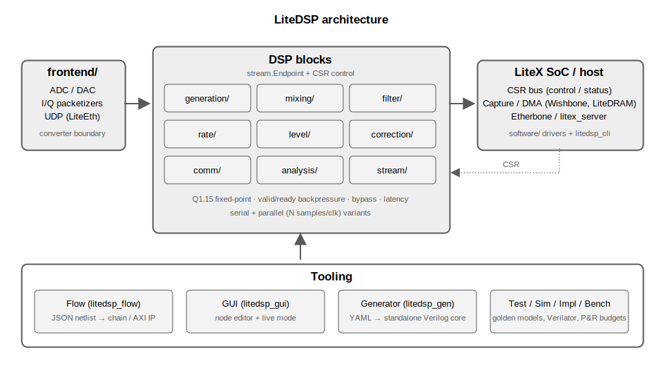

```
                                     __   _ __      ___  _______
                                    / /  (_) /____ / _ \/ __/ _ \
                                   / /__/ / __/ -_) // /\ \/ ___/
                                  /____/_/\__/\__/____/___/_/

                                   Copyright 2026 / Enjoy-Digital

                             Portable RF/DSP building blocks for FPGAs
                                      powered by Migen & LiteX

                           Work In Progress: APIs/blocks can still move!
```

[](https://github.com/enjoy-digital/litedsp/actions)  [](https://deepwiki.com/enjoy-digital/litedsp)

**🚧 Work In Progress**: LiteDSP is under active development — block interfaces, parameter names
and repository layout can still move/change until the first stable release. Feedback is very
welcome!

[> Intro
--------

LiteDSP provides a toolbox of portable, well-tested RF/DSP building blocks for FPGA, written in
Migen/LiteX. Every block is pure HDL (no vendor IP), so it simulates end-to-end and runs on any
FPGA, and every block shares one standardized streaming + control interface so blocks compose by
`connect()`.

LiteDSP is part of LiteX libraries whose aims are to lower entry level of complex FPGA cores by
providing simple, elegant and efficient implementations of components used in today's SoC such as
Ethernet, SATA, PCIe, SDRAM Controller...

The core can be used as a LiteX library or can be integrated with your standard design flow by
generating the Verilog RTL that you will use as a standard core (see the Generator and Flow
tooling below).

It is meant both as a ready-to-use library for RF processing on FPGA (mixers, NCO, filters,
rate conversion, gain/AGC, power, corrections, analysis) and as a clean base to customize
from for client-specific requirements.

[> Features
-----------

- **Portable-only**: pure Migen/LiteX, fully simulatable, FPGA-vendor agnostic.
- **Standardized interfaces**: LiteX `stream.Endpoint` streaming with full valid/ready
  backpressure; the `with_csr=True` / `add_csr()` control pattern everywhere; uniform
  `bypass`; each block exposes its `latency`. See `doc/interfaces.md`.
- **Fixed-point rigor**: parameterized Qm.n format (default Q1.15 / 16-bit), shared
  rounding / saturation / scaling helpers used at every downsizing point. See
  `doc/fixed_point.md`.
- **Tested**: numerical datapaths have NumPy golden reference models; simulation output is
  compared bit-exact or against an SNR threshold under `unittest` and CI. The generic Verilator
  harness additionally co-simulates 46 representative RTL configurations under randomized
  backpressure.



[> Blocks
---------

| Category        | Blocks                                                                      |
|-----------------|-----------------------------------------------------------------------------|
| `generation/`   | `LiteDSPNCO` (DDS), `LiteDSPCORDIC`, `LiteDSPChirp` (linear FM), `LiteDSPNoiseSource` (AWGN), `LiteDSPReplay` (RAM AWG), `LiteDSPPatternSource` (const/counter/PRBS/impulse) |
| `mixing/`       | `LiteDSPMixer` (complex, runtime up/down), `LiteDSPDDC`, `LiteDSPDUC`, `LiteDSPChannelizer` (DDC bank), `LiteDSPPFBChannelizer` (polyphase filter bank + DFT, critically sampled) |
| `filter/`       | `LiteDSPFIRFilter`/`LiteDSPFIRFilterComplex` (direct & symmetric), `LiteDSPFIRDecimator`/`LiteDSPFIRInterpolator` (polyphase), `LiteDSPCICDecimator`/`LiteDSPCICInterpolator` (+ runtime-rate), `LiteDSPHalfbandDecimator`/`LiteDSPHalfbandInterpolator`, `LiteDSPIIRBiquad`/`LiteDSPIIRBiquadCascade` (DF2T), `LiteDSPDCBlocker`, `LiteDSPMovingAverage`, `LiteDSPHilbert`, `LiteDSPPulseShaper` (RRC), `LiteDSPFarrowInterpolator`, `LiteDSPRationalResampler`, `LiteDSPArbResampler`, `LiteDSPNotch`, `LiteDSPCombFilter`, `LiteDSPAllpass`, `LiteDSPLMSEqualizer` (delayed LMS; trained/CMA/decision-directed), `design.py` (coefficients) |
| `rate/`         | `LiteDSPDownsampler`, `LiteDSPUpsampler` (naive), `LiteDSPDecimator`, `LiteDSPInterpolator` (CIC/FIR) |
| `level/`        | `LiteDSPGain`, `LiteDSPPower`, `LiteDSPSaturate`, `LiteDSPClipper`, `LiteDSPEnvelopeDetector`, `LiteDSPSquelch`, `LiteDSPAGC`, `LiteDSPDPD` (predistortion actuator, host-adapted complex-gain LUTs), `LiteDSPCFR` (crest-factor reduction, peak cancellation), `LiteDSPRMS`, `LiteDSPLog2`/`LiteDSPLogPower` (dB) |
| `correction/`   | `LiteDSPDCOffset`, `LiteDSPIQBalance`, `LiteDSPDerotator` (CFO)               |
| `comm/`         | `LiteDSPFMDemod`, `LiteDSPAMDemod`, `LiteDSPPhaseDetect`, `LiteDSPSlicer`, `LiteDSPSymbolMapper`, `LiteDSPDifferentialEncoder`/`Decoder`, `LiteDSPScrambler`/`LiteDSPDescrambler`, `LiteDSPCRC`, `LiteDSPConvEncoder`, `LiteDSPViterbiDecoder` (hard/soft-decision, LLR input), `LiteDSPPuncturer`/`LiteDSPDepuncturer` (DVB-S rate puncturing), `LiteDSPRSEncoder`/`LiteDSPRSDecoder` (Reed-Solomon RS(255,k) over GF(2^8), t up to 16, full Berlekamp-Massey/Chien/Forney decoder), `LiteDSPBlockInterleaver`/`LiteDSPBlockDeinterleaver` (CCSDS-style depth-I byte interleaving, ping-pong buffered), `LiteDSPLDPCEncoder`/`LiteDSPLDPCDecoder` (IEEE 802.11n rate-1/2 n=648 QC-LDPC: back-substitution encoder, row-layered normalized min-sum decoder with early termination), `LiteDSPCorrelator`, `LiteDSPFrameSync` (CFAR preamble detect + frame alignment), `LiteDSPCFOEstimator` (coarse CFO, delay-conjugate-multiply + CORDIC), `LiteDSPPLL`/`LiteDSPCostas`, `LiteDSPTimingRecovery` (M&M or Gardner TED), `LiteDSPCPInsert`/`LiteDSPCPRemove` (OFDM cyclic prefix), `LiteDSPOFDMEqualizer` (OFDM LS channel estimation + divider-free one-tap equalization, per-bin CSI) |
| `analysis/`     | `LiteDSPWindow`, `LiteDSPFFT` (radix-2 SDF, `inverse=`), `LiteDSPFFTIter`, `LiteDSPPSD`, `LiteDSPWelchPSD`, `LiteDSPMagnitude` (approx/CORDIC), `LiteDSPGoertzel`, `LiteDSPStats`, `LiteDSPHistogram`, `LiteDSPPeakBin`, `LiteDSPEnergyDetector`, `LiteDSPFrequencyEstimator`, `LiteDSPErrorCounter` (SER/BER) |
| `stream/`       | `LiteDSPCombine`, `LiteDSPSplit`, `LiteDSPDelay`, `LiteDSPChannelMux`/`LiteDSPChannelDemux`, `LiteDSPConjugate`/`LiteDSPSwapIQ`/`LiteDSPNegate`/`LiteDSPIQAdd`, offset-binary converters, `LiteDSPIQClockDomainCrossing`, `LiteDSPSkidBuffer`, `LiteDSPStreamFIFO`, `LiteDSPIQPack`/`LiteDSPIQUnpack`, `LiteDSPCapture` (scope, CSR or memory-mapped readout), `LiteDSPCSRSource`/`LiteDSPCSRSink`/`LiteDSPCSRReader`/`LiteDSPNullSink`, `LiteDSPStreamFramer`/`LiteDSPStreamDeframer` (`tlast`), `LiteDSPTimeCore`/`LiteDSPTimestamper`/`LiteDSPTimeUntagger` (timestamped streams, see `doc/timestamps.md`), `LiteDSPDMACapture`/`LiteDSPDMAReplay` (Wishbone or LiteDRAM DMA) |
| `frontend/`     | `LiteDSPADCInterface`/`LiteDSPDACInterface` (raw converter words), `LiteDSPIQPacketizer`/`LiteDSPIQDepacketizer` (framed host-link words, LitePCIe-ready, optional timestamp header), `LiteDSPUDPIQStreamer`/`LiteDSPUDPIQReceiver` (I/Q packets over LiteEth UDP) |
| parallel (*)    | `LiteDSPParallelNCO`, `LiteDSPParallelMixer`, `LiteDSPParallelFIRFilter`/`LiteDSPParallelFIRFilterComplex`, `LiteDSPParallelCICDecimator`, `LiteDSPParallelFFT` (radix-2 DIF split, 2 samples/clk), `LiteDSPParallelDDC` composite + `LiteDSPIQSerialToParallel`/`LiteDSPIQParallelToSerial` adapters |
| misc            | `LiteDSPISqrt` (`numeric.py`), `LiteDSPPILoop` (`control.py`)                 |

(*) Multi-sample-per-cycle datapaths (N samples/clk for rates above the fabric clock, e.g. a
gigasample RX front-end), bit-identical to their serial counterparts. The parallel variants
live next to their serial versions (`generation/nco_parallel.py`, ...).

Per-block FPGA resource/fmax numbers (ECP5 + Artix-7): see `doc/resources.md`.

[> Tooling
----------

| Tool               | What it does                                                       | Run |
|--------------------|--------------------------------------------------------------------|-----|
| Flow (`flow/`)     | JSON netlist → chain Verilog + CSR map + AXI-Stream/AXI-Lite IP core | `litedsp_flow flow.json` |
| GUI (`gui/`)       | DearPyGui node editor for flow netlists (GNU-Radio-Companion style), with **live mode**: connect to a running SoC and tune NCOs/gains/FIR taps, watch the PSD | `litedsp_gui` |
| Generator (`gen.py`) | Standalone core in the LiteX-ecosystem style: YAML → Verilog core + `csr.csv`/`csr.json`/`csr.h` | `litedsp_gen config.yml` |
| Software (`software/`) | Host-side drivers over `litex_server`: tune in Hz, reload taps, drain captures to NumPy, run DMA windows; register-map auto-discovery | `litedsp_cli info` |
| Examples (`examples/`) | Assembled chains: DDC/DUC, spectrum analyzer, FM receiver, QPSK RX, wideband RX, PRBS loopback BER, AXI IP preview; YAML configs for the generator | `python3 examples/fm_receiver.py` |
| Tests (`test/`)    | Golden-model harness: NumPy reference models, bit-exact/SNR checks under randomized backpressure | `python3 -m unittest discover -s test` |
| Sim (`sim/`)       | Verilator (real HDL) co-simulation vs the NumPy models + full-registry lint sweep | `python3 sim/run_blocks.py` |
| Impl (`impl/`)     | Yosys/nextpnr (ECP5) + Vivado (Artix-7) synth/P&R gated on resource + fmax budgets | `python3 impl/run.py --device ecp5` |
| Formal (`formal/`) | SymbiYosys proof of the stream fabric: no sample loss/duplication under arbitrary backpressure, stability while stalled | `python3 formal/run_formal.py` |
| Char (`char/`)     | Quality characterization: SFDR/ENOB, ripple/attenuation, CIC droop error, image rejection, IMD3, settling — measured on the golden models, gated on quality budgets | `python3 char/run_char.py` |
| Bench (`bench/`)   | Hardware proof points on litex-boards targets (Arty, Colorlight 5A-75B): CSR-controlled spectrum bench, Etherbone + UDP I/Q streaming bench | `python3 bench/spectrum.py --board=arty --build` |

[> Getting started
------------------

1. Install Python 3.7+ and Verilator (for HDL co-simulation).
2. Install LiteX and its ecosystem by following the LiteX Wiki [installation guide](https://github.com/enjoy-digital/litex/wiki/Installation).
3. Install LiteDSP:
```sh
git clone https://github.com/enjoy-digital/litedsp
cd litedsp
python3 setup.py develop --user
```
4. Compose blocks in a LiteX SoC (see `doc/litex_integration.md`):
```python
from litedsp.generation.nco import LiteDSPNCO
from litedsp.mixing.mixer   import LiteDSPMixer

self.nco   = LiteDSPNCO(data_width=16)
self.mixer = LiteDSPMixer(data_width=16)
self.comb += self.nco.source.connect(self.mixer.sink_b)
```
or generate a standalone Verilog core from a YAML config:
```sh
litedsp_gen examples/ddc_core.yml
```
Assembled-chain demos live in `examples/`.

[> Documentation
----------------

| Document                  | Content                                                    |
|---------------------------|------------------------------------------------------------|
| `doc/blocks/index.md`     | **Block catalog**: one generated datasheet per block (parameters, ports, register map, resources) |
| `doc/interfaces.md`       | The block contract: streaming, control, conventions checklist |
| `doc/fixed_point.md`      | Qm.n conventions, rounding/saturation rules                 |
| `doc/timestamps.md`       | Timestamped streams: edge tagging, latency back-computation, packet header |
| `doc/litex_integration.md`| Using blocks/chains in a LiteX SoC and in non-LiteX flows   |
| `doc/flow.md`             | Netlist format, flow/GUI usage, IP core generation          |
| `doc/resources.md`        | Per-block LUT/FF/BRAM/DSP + fmax table (generated)          |
| `doc/characterization.md` | Per-block quality metrics: measured + guaranteed (generated)|
| `doc/implementation.md`   | The impl/ flows and budget gating                           |
| `doc/formal.md`           | What is formally proven per plumbing block, and the honest scope |
| `CONTRIBUTING.md`         | New-block checklist, tests, commit conventions              |

[> Tests
--------

Unit tests are available in `./test/`. To run all the unit tests:
```sh
python3 -m unittest discover -s test -v
```
Tests can also be run individually:
```sh
python3 -m unittest test.test_nco -v
```

[> License
----------

LiteDSP is released under the very permissive two-clause BSD license. Under the terms of this
license, you are authorized to use LiteDSP for closed-source proprietary designs.

Even though we do not require you to do so, those things are awesome, so please do them if
possible:
- tell us that you are using LiteDSP
- put the LiteDSP logo in your documentation
- cite LiteDSP in publications related to research it has helped
- send us feedback and suggestions for improvements
- send us bug reports when something goes wrong
- send us the modifications and improvements you have done to LiteDSP.

[> Support and consulting
-------------------------

We love open-source hardware and like sharing our designs with others.

LiteDSP is developed and maintained by EnjoyDigital.

If you would like to know more about LiteDSP or if you are already a happy user and would like to
extend it for your needs, EnjoyDigital can provide standard commercial support as well as consulting
services.

So feel free to contact us, we'd love to work with you! (and please tell us a bit about your project
so we can quickly see if we can help you or not:)

[> Contact
----------
E-mail: florent [AT] enjoy-digital.fr
