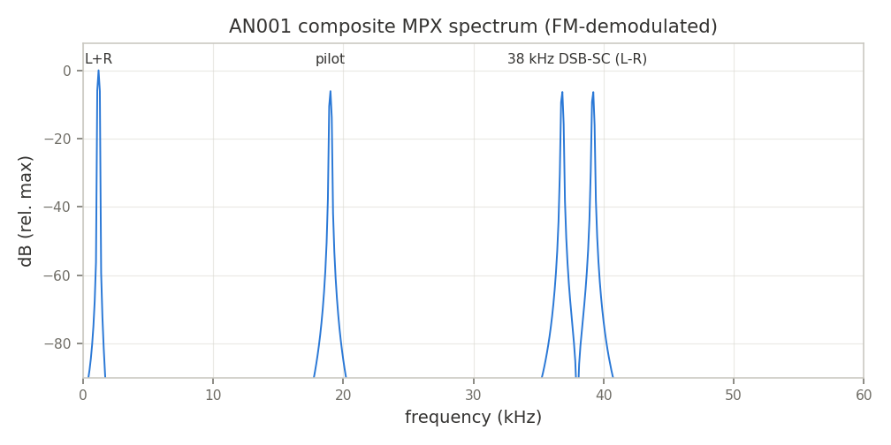
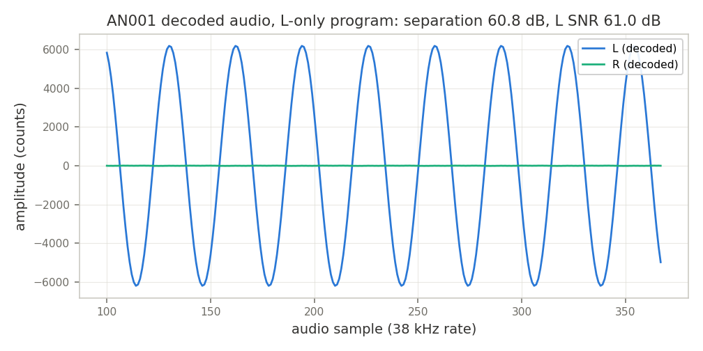

# AN001 — FM stereo broadcast receiver (pilot-squaring stereo decoder)

Example: [`examples/fm_stereo_receiver.py`](../../examples/fm_stereo_receiver.py)

## Objective

Decode the full FM *stereo* multiplex (MPX) with a LiteDSP chain, extending the mono
[`examples/fm_receiver.py`](../../examples/fm_receiver.py): recover the 38 kHz stereo subcarrier
from the 19 kHz pilot, demodulate the DSB-SC (L−R) band, and matrix back to L and R. The golden
property is **stereo separation**: with an L-only program, the R output must be residual only
(gated at ≥ 30 dB below L), plus an audio-SNR gate on the decoded L tone.

The composite is generated in NumPy — `0.4·(L+R) + 0.2·pilot(19 kHz) + 0.4·(L−R)·cos(2π·38k·t)`
— FM-modulated at baseband, and driven through the RTL chain with the `test/common.py` stream
simulator.

## Block diagram

```
 I/Q                     MPX (152 kHz, real on I)
 --> FMDemod --> Split --+--> StreamFIFO --> Split --+--> LP decim FIR (x4, mono) --- M=(L+R) --> IQAdd
                         |                           |                                              ^
                         |                           `--> Mixer(up) --> LP decim FIR --- S=(L-R) ---'
                         |                                    ^         (x4, gain-calibrated)
                         |                              38 kHz carrier                 IQAdd matrix:
                         |                                    |                        L = M+S (on I)
                         `--> BP 19 kHz --> Mixer(up) --> BP 38 kHz                    R = M-S (on Q)
                              (pilot)       (squaring: pilot^2 = DC + 38 kHz)
```

- **38 kHz regeneration by pilot squaring**: `cos²(ωt) = (1 + cos 2ωt)/2` — the classic analog
  stereo-decoder trick, no PLL needed. The squared pilot's second harmonic is band-passed at
  38 kHz and is *phase-coherent* with the transmitted subcarrier by construction.
- **Phase alignment by design**: all filters are linear-phase FIRs; the sample rate is
  8 × 19 kHz = 152 kHz, so the 38 kHz period is 4 samples. The pilot-path group delays
  (τ<sub>BP19</sub> = 16, τ<sub>BP38</sub> = 12) sum to 28 ≡ 0 mod 4 samples — an integer
  number of 38 kHz periods — so the regenerated carrier lands exactly in phase. (The squaring
  doubles the pilot phase, so both group delays count at 38 kHz.)
- **Gain matching by design-time calibration**: the (L−R) path gain depends on the regenerated
  carrier amplitude. The example predicts it with the *bit-exact* NumPy golden models
  (`test/models.py`: `fir_model` + the mixer's round/saturate arithmetic) and bakes the
  compensating gain into the (L−R) low-pass decimator taps — so the L/R matrix cancels exactly.
- **Matrixing with `LiteDSPIQAdd`**: mono is fed to both I and Q of `sink_a`, ±(L−R) to
  `sink_b`, so one saturating complex add produces L on I and R on Q.
- The `StreamFIFO` gives the direct path the elasticity to absorb the pilot-path pipeline fill
  (the two paths re-join at the L−R mixer). Note that a `Split` directly feeding both inputs of
  the squaring mixer would form a combinational valid/ready cycle (split gates `valid` on
  all-ready, the mixer gates each sink's `ready` on the other sink's `valid`), so the pilot
  drives both mixer sinks directly.

### Documented simplifications

An honest demo subset, not a broadcast-grade decoder:

- **Elevated pilot** (20 % instead of the 9 % standard) for headroom in the Q1.15 squaring path
  (the squared amplitude scales with the *square* of the pilot level).
- **Narrow demo filters** sized for tone program material and simulation speed (audio low-pass
  cutoff 7.6 kHz, 25–33 taps). Real program material needs sharper filters (and the pilot at
  19 kHz must be rejected harder by the audio low-pass).
- No de-emphasis, no pilot-presence detection (mono/stereo blend), no SCA/RDS handling.

## Chain & resource total

Reference per-block numbers from [`impl/budgets.json`](../../impl/budgets.json) (default
configurations, 16-bit datapath; see `doc/resources.md`). The band-pass FIRs here are *fixed*
coefficient and `symmetric=True` (folded taps), so they come in **below** the runtime-coefficient
32-tap `fir` reference row.

| Block (datasheet) | Instances | ECP5 LUT/FF/BRAM/DSP (ref) |
|---|---|---|
| [`fm_demod`](../blocks/fm_demod.md) | 1 | 1720/790/0/4 |
| [`fir_real`](../blocks/fir_real.md) (BP19, BP38) | 2 | 2715/1555/0/32 each (32-tap runtime-coeff ref) |
| [`mixer`](../blocks/mixer.md) (squaring, L−R demod) | 2 | 351/296/0/4 each |
| [`fir_decimator`](../blocks/fir_decimator.md) (mono, L−R) | 2 | 471/104/0/2 each |
| [`stream_fifo`](../blocks/stream_fifo.md) | 1 | 32/14/0/0 |
| [`split`](../blocks/split.md), [`combine`/IQAdd glue](../blocks/combine.md) | 2 + 1 | combinational glue |
| **Indicative total** | | **≈ 8.8 k LUT / 4.7 k FF / 0 BRAM / 80 DSP** |

(The dominant `fir` rows halve in DSP count with the symmetric fold actually used here.)

## Build & run

```sh
python3 examples/fm_stereo_receiver.py            # full run, plots to doc/app_notes/img/
python3 examples/fm_stereo_receiver.py --plot-dir /tmp/an001   # plots elsewhere
AN001_SAMPLES=512 python3 examples/fm_stereo_receiver.py       # shorter (dev) run
python3 -m unittest test.test_examples.TestAppNoteExamples.test_fm_stereo_receiver_smoke -v
```

The script asserts the golden gates (separation ≥ 30 dB, L audio SNR ≥ 25 dB) and exits
non-zero on failure; it runs headless (matplotlib Agg, `savefig` only).

## Results

Measured on the default run (1536 MPX samples through the Migen simulation, L-only program,
1187.5 Hz tone; measurement window = whole tone periods after the settling transient):

```
FM stereo receiver (AN001): fs=152 kHz, 1536 MPX samples, pilot-squaring 38 kHz regeneration
  L audio: 4391 counts rms, tone SNR 61.0 dB (vs LS-fitted 1187.5 Hz tone)
  R audio: 4.0 counts rms (crosstalk)
  stereo separation: 60.8 dB
  PASS: L-only program decoded with >= 30 dB separation, >= 25 dB audio SNR
```

Runtime: ~80 s wall (Migen simulation; sized for the CI smoke budget).

The FM-demodulated composite shows the textbook MPX structure — mono audio, pilot, and the
DSB-SC (L−R) sidebands around 38 kHz:



Decoded audio: L carries the tone, R is residual (the separation figure):



The bit-exact NumPy prototype of the same chain measures ~58 dB separation; the RTL comes in at
the same level (CORDIC angle quantization in `FMDemod` is below the measurement floor here).
The gates are set at 30 dB / 25 dB with generous margin so seed rotation and parameter tweaks
don't flake CI.

## Cross-links

- [`fm_demod`](../blocks/fm_demod.md) — FM discriminator (conjugate product + CORDIC vectoring)
- [`fir_real`](../blocks/fir_real.md) — the band-pass FIRs (symmetric fold)
- [`mixer`](../blocks/mixer.md) — squaring + L−R demodulation (`MIXER_MODE_UP`)
- [`fir_decimator`](../blocks/fir_decimator.md) — audio low-pass decimators (gain-calibrated taps)
- [`stream_fifo`](../blocks/stream_fifo.md) — direct-path elasticity
- [`split`](../blocks/split.md) — stream fan-out (and its handshake contract)
- `litedsp/filter/design.py` — `firwin_bandpass`/`firwin_lowpass` used for all coefficients
