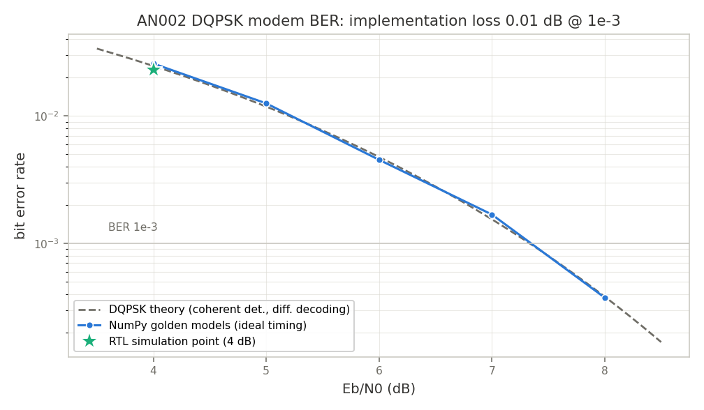

# AN002 — DQPSK modem loopback and BER curve

Example: [`examples/qpsk_modem.py`](../../examples/qpsk_modem.py)

## Objective

Close the loop on a full digital modem built from LiteDSP blocks — transmit, channel, receive —
and characterize it the way a modem is actually judged: **BER vs Eb/N0 against theory**. The
golden properties are (1) implementation loss < 1 dB at BER 10⁻³ vs the coherently-detected
DQPSK theory curve, and (2) a full RTL simulation point that matches the NumPy golden models
(TX waveform bit-identical, BER consistent).

## Block diagram

```
 TX (RTL)                                                     channel (NumPy)
 PRBS bits -> Gray dibits --+                                +----------------------+
                            v                                |  fractional delay    |
   +-------------+   +--------------+   +---------------+   |  (0.35 sample)       |
   | DiffEncoder |-->| SymbolMapper |-->| PulseShaper    |-->|  + 90 deg rotation   |--+
   | (mod 4)     |   | (QPSK, [q|i])|   | (RRC, 2 sps)   |   |  + AWGN @ Eb/N0      |  |
   +-------------+   +--------------+   +---------------+   +----------------------+  |
                                                                                       |
 RX (RTL)                                                                              |
   +---------------+   +----------------+   +--------+   +-------------+              |
   | RRC matched   |<--|      <---      |<--|  <---  |<--|    <---     |<-------------+
   | filter (FIR)  |-->| TimingRecovery |-->| Slicer |-->| DiffDecoder |--> dibits -> bits
   +---------------+   | (M&M, 2 sps)   |   +--------+   | (mod 4)     |    -> BER count
                       +----------------+                +-------------+
```

- **Differential (DQPSK) encoding** carries the data in *phase increments*
  (Gray-coded: one quadrant step = one bit error). The channel rotates the constellation by
  exactly 90°; the slicer happily decides in the rotated constellation and the differential
  decode cancels the constant offset — no carrier-*phase* loop needed. Small build-time LUTs
  translate between phase indices and the mapper/slicer symbol encoding (`[q|i]`).
- **Carrier-frequency recovery is out of scope** (documented honest subset): the shipped
  [`carrier_loop`](../blocks/carrier_loop.md) detectors target residual-carrier tones (PLL) and
  suppressed-carrier BPSK (Costas); a 4th-power / decision-directed QPSK detector is future
  work, so this note runs with frequency-locked LOs and demonstrates the *quadrant ambiguity*
  resolution instead.
- **Timing recovery is real**: the channel applies a 0.35-sample fractional delay (all-pass
  FFT delay), and the Mueller & Müller interpolating loop
  ([`timing_recovery`](../blocks/timing_recovery.md)) acquires and tracks it. During
  acquisition the loop can slip samples, so the RX symbol index may *lead* the TX index — the
  BER counter aligns with a signed offset search after discarding the acquisition transient.

## Model sweep + one RTL point

Simulating enough symbols for a BER curve in the Migen simulator would take hours, so the sweep
runs on the **bit-exact NumPy golden models** from `test/models.py`
(`diff_encode_model`, `fir_interpolator_model` = the PulseShaper core, `fir_complex_model` =
the matched filter, `diff_decode_model`), with one substitution: the timing loop has no NumPy
model, so the model RX samples at the known optimum instant (genie timing; TX + MF group delay,
fractional delay undone by the same all-pass). This is documented, and the RTL point closes the
gap:

- the **RTL TX waveform is asserted bit-identical** to the model TX (`np.array_equal`), and
- the **RTL BER** (real M&M loop, same noise realization) must sit within 3× of the model BER
  at that Eb/N0.

The RTL point runs both chains end-to-end in the Migen simulator at Eb/N0 = 4 dB (highest BER
point → best error statistics per simulated symbol; 1500 symbols keeps the CI smoke < 2 min).

Theory reference: coherently-detected, differentially-encoded Gray QPSK,
`Pb = 2Q(1−Q)` with `Q = Q(sqrt(2 Eb/N0))` — the ~×2 penalty of differential decoding over
plain QPSK, not the larger noncoherent-DQPSK penalty.

## Chain & resource total

Reference per-block numbers from [`impl/budgets.json`](../../impl/budgets.json) (default
configurations; see `doc/resources.md`). Mapper, slicer, and differential coder are a few LUTs
each (not separately characterized).

| Block (datasheet) | Role | ECP5 LUT/FF/BRAM/DSP (ref) |
|---|---|---|
| [`diff_encoder`](../blocks/diff_encoder.md) / [`diff_decoder`](../blocks/diff_decoder.md) | DQPSK phase (de)accumulation | negligible |
| [`symbol_mapper`](../blocks/symbol_mapper.md) / [`slicer`](../blocks/slicer.md) | constellation map / hard decision | negligible |
| [`pulse_shaper`](../blocks/pulse_shaper.md) ([`fir_interpolator`](../blocks/fir_interpolator.md) core) | TX RRC, 2 sps | 338/86/0/2 |
| [`fir_complex`](../blocks/fir_complex.md) | RX matched RRC | 181/106/0/2 |
| [`timing_recovery`](../blocks/timing_recovery.md) | M&M symbol sync | 1030/292/0/16 |
| **Indicative total** | | **≈ 1.5 k LUT / 0.5 k FF / 0 BRAM / 20 DSP** |

On hardware the PRBS source and the error counter also exist as blocks —
[`pattern_source`](../blocks/pattern_source.md) (114/65/0/0) and
[`error_counter`](../blocks/error_counter.md) (97/64/0/0) — used from the bus for on-FPGA
self-test (see `examples/loopback_ber.py`). Here the bits are generated and scored on the host
because the M&M acquisition slips make the RX/reference alignment data-dependent; a real modem
frames first ([`frame_sync`](../blocks/frame_sync.md)) and counts after sync.

## Build & run

```sh
python3 examples/qpsk_modem.py                 # sweep + RTL point, plot to doc/app_notes/img/
python3 examples/qpsk_modem.py --plot-dir /tmp/an002
AN002_RTL_SYMBOLS=300 python3 examples/qpsk_modem.py     # shorter (dev) RTL point
python3 -m unittest test.test_examples.TestAppNoteExamples.test_qpsk_modem_smoke -v
```

Headless (matplotlib Agg, `savefig` only); asserts the golden gates and exits non-zero on
failure.

## Results

Measured on the default run:

```
  model sweep (NumPy golden models):
    Eb/N0 4 dB: BER 2.58e-02 (39920 bits, theory 2.47e-02)
    Eb/N0 5 dB: BER 1.26e-02 (39920 bits, theory 1.18e-02)
    Eb/N0 6 dB: BER 4.53e-03 (79920 bits, theory 4.77e-03)
    Eb/N0 7 dB: BER 1.68e-03 (119920 bits, theory 1.54e-03)
    Eb/N0 8 dB: BER 3.75e-04 (239920 bits, theory 3.82e-04)
  Eb/N0 @ BER 1e-3: measured 7.35 dB, theory 7.33 dB, implementation loss 0.01 dB
  RTL point: Eb/N0 4 dB, 1500 symbols (Migen simulation of both chains)...
    RTL   BER 2.31e-02 (1904 bits)  [TX waveform == model: OK]
    model BER 1.64e-02 (1952 bits) on the same noisy waveform
  PASS: loss 0.01 dB < 1.0 dB @ BER 1e-3, RTL point consistent with model
```



The fixed-point TX/RX (Q1.15 RRC taps, 16-bit datapath, hard-decision slicing at ideal timing)
costs essentially nothing at these operating points — the measured curve hugs the theory curve
(0.01 dB at the 10⁻³ crossing, gated at < 1 dB). The RTL point with the real timing loop sits
slightly above the genie-timed model (M&M timing self-noise at 2 sps; ×1.4 here), within the 3×
consistency gate. Runtime: ~75 s wall, dominated by the RTL point (the model sweep itself is
~15 s; sizes documented in the script and trimmed for CI).

## Cross-links

- [`pulse_shaper`](../blocks/pulse_shaper.md) — TX RRC interpolator (matched-pair ISI/EVM data)
- [`fir_complex`](../blocks/fir_complex.md) — RX matched filter
- [`timing_recovery`](../blocks/timing_recovery.md) — M&M / Gardner symbol synchronization
- [`slicer`](../blocks/slicer.md) / [`symbol_mapper`](../blocks/symbol_mapper.md) — hard decisions / constellation mapping
- [`diff_encoder`](../blocks/diff_encoder.md) / [`diff_decoder`](../blocks/diff_decoder.md) — DQPSK differential coding
- [`carrier_loop`](../blocks/carrier_loop.md) — why carrier-frequency recovery is out of scope here
- [`pattern_source`](../blocks/pattern_source.md) / [`error_counter`](../blocks/error_counter.md) / [`frame_sync`](../blocks/frame_sync.md) — the on-FPGA BER-test path
