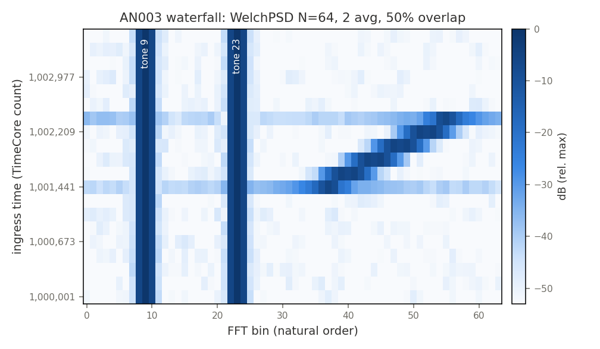
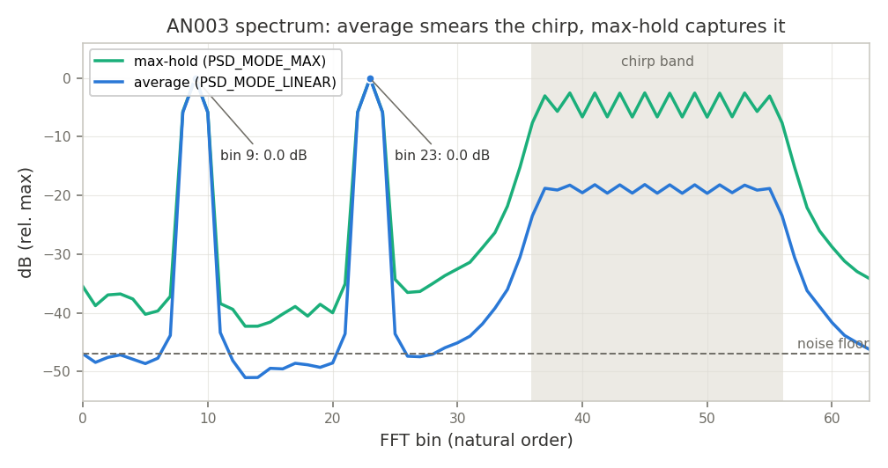

# AN003 — Spectrum Monitor with Waterfall

Runnable example: [`examples/spectrum_monitor.py`](../../examples/spectrum_monitor.py) —
`python3 examples/spectrum_monitor.py` (headless, self-checking, writes the plots below).

## Objective

Build a timestamped spectrum monitor from LiteDSP analysis blocks and show, on one stimulus
(two CW tones + a transient chirp burst + noise), the two complementary M6 PSD views:

- **Welch averaging with 50% overlap** (`LiteDSPWelchPSD`) — successive averaged spectra,
  stacked host-side into a waterfall;
- **max-hold** (`PSD_MODE_MAX`) — the per-bin peak trace that catches the transient chirp the
  averaged trace smears by ~13 dB.

The stream is tagged at ingress by `LiteDSPTimestamper`/`LiteDSPTimeCore`
(`litedsp/stream/timestamp.py`), so the waterfall y-axis is **absolute sample time** — even
though the Welch overlap replay and the PSD readout stall the input (2496 stall cycles over
1344 samples in this run).

## Block diagram

```
             ┌──────────┐   ┌─────────────┐   ┌──────────────┐   ┌────────────────────────────┐
 I/Q in ────►│Timestamper├──►│TimeUntagger ├──►│  WelchPSD (overlap=50%)                       │
             └────▲─────┘   └─────────────┘   │  Window(hann) -> FFT -> PSD(mode=linear/max)  ├──► spectra
             ┌────┴─────┐                     └──────────────────────────────────────────────┘
             │ TimeCore │  (free-running 64-bit count, host-set epoch)
             └──────────┘
```

Host side: reshape the captured `N`-bin frames into a 2-D waterfall, label rows with the
ingress timestamps, and detect peaks (host-side argmax in natural bin order — the same
convention as the `LiteDSPPeakBin` block, which could do it on-chip).

## Chain & resources

| Block | Role | ECP5 LUT/FF/BRAM/DSP | Artix-7 LUT/FF/BRAM/DSP | Fmax (MHz) |
|---|---|---|---|---|
| `LiteDSPTimeCore` + `LiteDSPTimestamper` | absolute ingress time (params, latency 0) | not characterized | - | - |
| `LiteDSPWindow` (hann) | leakage control before the FFT | 341/15/0/2 | 67/19/0/2 | 100 |
| `LiteDSPFFT` | radix-2 SDF, latency N-1 | 2987/360/0/28 | 1525/367/0/35 | 73 |
| `LiteDSPPSD` | \|X\|² combining: linear / exp / max / min-hold | 855/31/0/2 | 343/30/0/2 | 89 |

(Reference numbers at default parameters from [`doc/resources.md`](../resources.md);
`LiteDSPWelchPSD` composes Window/FFT/PSD and adds one N-sample history RAM for the overlap
replay.)

Example configuration: `N=64`, `avg_log2=1` (2 segments per spectrum), `overlap=50`,
Hann window, 16-bit I/Q. With 50% overlap the sustained input rate is bounded by
~`f_clk/2` (each 64-sample segment is followed by 32 replay cycles).

## Timestamps: absolute time on the waterfall axis

Following [`doc/timestamps.md`](../timestamps.md), time is tagged **once** at the edge and
computed everywhere else:

- `LiteDSPTimeCore.count` free-runs from the host-set epoch (1,000,000 in the example — on
  hardware, written through the `set_time` CSR);
- `LiteDSPTimestamper` tags every accepted sample with its ingress count (the stream is
  unframed at that point, so each sample carries its own time);
- `LiteDSPTimeUntagger` strips the params before the time-agnostic Welch chain.

The fixed-latency prefix of the chain sums to
`timestamper(0) + untag(0) + window(1) + fft(63) = 64` samples, printed by the script; the
PSD is frame-accumulating (`latency = None`), which is exactly the *"re-timestamp after
data-dependent blocks"* case of the recipe — here we instead keep the ingress tags and use
the segmentation arithmetic: with `avg_log2=1` and 50% overlap, waterfall row `m` averages
Welch segments `2m` and `2m+1`, i.e. ingress samples `[64m, 64m+96)` in *sample index*;
in *absolute time* the row is labeled `ts[64*m]` where `ts` is the recorded ingress
timestamp of that sample (row step = 2 segments x 32 new samples = 64). Stall cycles
(overlap replay, PSD readout) appear as gaps in `ts` and are correctly excluded — that is
the point of timestamping at the edge instead of counting cycles on the host.

The script back-computes the chirp-burst onset from the waterfall alone: first row whose
chirp-band power exceeds the floor by 10 dB -> row 8 @ count 1,001,441, vs the true ingress
tag 1,001,521 of the first burst sample (within one row of slack; asserted).

## Build & run

```
python3 examples/spectrum_monitor.py               # plots into doc/app_notes/
python3 examples/spectrum_monitor.py --plot-dir /tmp/plots
```

Runs the Migen simulation twice on the same deterministic stimulus (1500 samples: tones at
bins 9 and 23, amplitude 6000; a 5000-amplitude chirp sweeping bins 36->56 during samples
560..880; sigma=60 AWGN): once with `PSD_MODE_LINEAR` (20 spectra -> waterfall), once with
`PSD_MODE_MAX` (the last emitted spectrum is the cumulative peak trace). On hardware the
mode switch is one CSR write (`psd_control.mode`), and `psd_control.clear` restarts the
max-hold trace. Takes ~80 s (Migen pysim); matplotlib is optional (assertions run without it).

## Results

```
Spectrum monitor: N=64, 2 avg/spectrum, 50% overlap, epoch=1,000,000
  chain latencies: timestamper=0 + untag=0 + window=1 + fft=63 = 64 samples (PSD is frame-accumulating: variable)
  ingress: first sample @ 1,000,001, 2496 stall cycles absorbed over 1344 samples (Welch replay + PSD readout)
  noise floor ~  -47.0 dB
    detected peak bin  9 (injected  9):   -0.0 dB
    detected peak bin 23 (injected 23):   -0.0 dB
  chirp band bins 38..54: max-hold - average = 13.4 dB (median), max-hold min = -6.7 dB vs floor -47.0 dB
  chirp onset: row 8 @ 1,001,441 (true ingress 1,001,521, row covers 64 + overlap samples)
  PASS: tones within a bin, max-hold captures the chirp the average smears, onset located in absolute time
```

Asserted golden properties:

- both injected tones are recovered at their exact bin (within-a-bin gate);
- the max-hold trace holds the chirp band >= 10 dB above the noise floor while the linear
  average smears it (median max-hold - average = **13.4 dB** over the sweep band);
- the chirp onset is located in absolute time from the timestamped waterfall rows.



The two vertical stripes are the CW tones; the diagonal is the chirp sweeping bins 36->56;
the y-axis is the absolute `TimeCore` count of each row's first ingress sample.



## GNU Radio interop: streaming the same I/Q to `udp_source`

The monitor's input (or any tap of the chain) streams to a host with
`LiteDSPUDPIQStreamer` (`litedsp/frontend/udp.py`), which packs the I/Q stream into
fixed-size UDP datagrams via `LiteDSPIQPacketizer`:

```python
udp = LiteEthUDPIPCore(phy, mac_address=..., ip_address="192.168.1.50", clk_freq=...)
self.iq_streamer = LiteDSPUDPIQStreamer(udp.udp,
    ip_address="192.168.1.100", udp_port=6000,    # Host running GNU Radio.
    data_width=16, word_width=32, samples_per_packet=256)
self.comb += chain.source.connect(self.iq_streamer.sink)
```

Wire format (default `with_timestamp=False`, from `litedsp/frontend/packet.py` /
`litedsp/stream/adapt.py`):

- one datagram = `samples_per_packet` = 256 samples = **1024 payload bytes**;
- each 32-bit word is one sample, `Cat(i, q)`: **I in bits [15:0], Q in bits [31:16]**,
  first sample in the first word;
- LiteEth serializes words LSB-first, so the wire byte order is
  `I0.lsb, I0.msb, Q0.lsb, Q0.msb, I1.lsb, ...` — i.e. **interleaved 16-bit signed
  little-endian I/Q**, exactly GNU Radio's "short" complex convention.

Flowgraph (GRC), no custom blocks needed:

| Block | Parameters |
|---|---|
| UDP Source | port 6000, output type `short`, payload size 1024 |
| Interleaved Short To Complex | vector input off, swap off, scale factor 32768.0 |
| QT GUI Waterfall / Frequency Sink | FFT 64, fc/samp_rate of your front-end |

The scale factor maps Q1.15 full-scale to ±1.0. With `with_timestamp=True` the packetizer
prepends a 16-byte header per datagram (LSB-first: magic `0xDA`, version `0x01`,
`stream_id`, reserved, 32-bit sample count, 64-bit `TimeCore` timestamp — layout in
[`doc/timestamps.md`](../timestamps.md)); GNU Radio's stock `udp_source` does not strip
headers, so either keep the default headerless format for stock interop, or strip the first
16 bytes in a small Python block and emit the timestamp as a stream tag.

## Cross-links

- [`welch`](../blocks/welch.md) — Welch PSD composite (overlap replay, throughput bound)
- [`psd`](../blocks/psd.md) — combining modes (linear/exponential/max/min) + `clear` CSR
- [`window`](../blocks/window.md) — window functions and leakage
- [`fft`](../blocks/fft.md) — radix-2 SDF FFT, latency/scaling
- [`timestamper`](../blocks/timestamper.md) / [`time_untagger`](../blocks/time_untagger.md)
  — edge tagging in/out (and `LiteDSPPeakBin` in `litedsp/analysis/peak_bin.py` for the
  on-chip argmax equivalent of the host-side peak detection used here)
