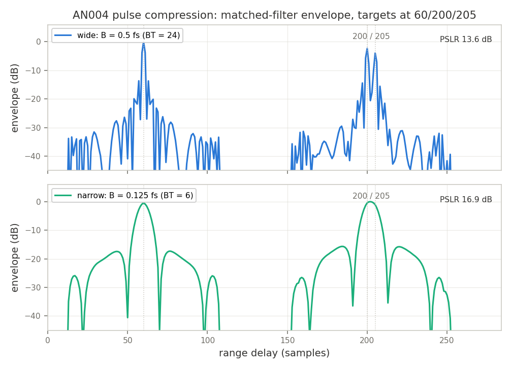
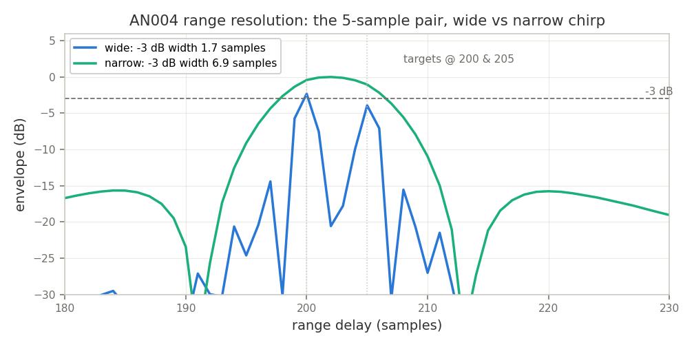

# AN004 — Chirp Pulse-Compression Radar

Runnable example: [`examples/chirp_radar.py`](../../examples/chirp_radar.py) —
`python3 examples/chirp_radar.py` (headless, self-checking, writes the plots below).

## Objective

Demonstrate classic pulse-compression ranging with LiteDSP blocks: a linear-FM pulse from
the `LiteDSPChirp` hardware generator is echoed by a simulated 3-target channel
(delay + attenuation + AWGN, NumPy), compressed by a **complex-tap matched filter** built
from `LiteDSPFIRFilterComplex` pairs, and envelope-detected with `LiteDSPMagnitude`. Peak
positions of the compressed pulse are the target ranges; two chirp bandwidths show the
range-resolution / bandwidth trade (a 5-sample target pair is resolved at `B = fs/2` and
merged at `B = fs/8`), and the peak-to-sidelobe ratio is gated.

## Block diagram

```
┌───────────┐  P-sample     ┌────────────────────┐
│LiteDSPChirp├── LFM pulse ─►│ NumPy target channel│  (3x delay+attenuation, AWGN)
└───────────┘  (captured)   └─────────┬──────────┘
                                      │ echoes
             ┌────────────────────────▼───────────────────────┐   ┌──────────────┐
             │ ChirpMatchedFilter                              │   │              │
             │  fir_re: FIRFilterComplex, taps Re(h)  ┐        ├──►│  Magnitude   ├──► envelope
             │  fir_im: FIRFilterComplex, taps Im(h)  ┘ combine│   │ (a-max-b-min)│    -> peaks = ranges
             │  y = (re.i - im.q) + j(re.q + im.i)             │   └──────────────┘
             └───────────────────────────────────────────────┘
                 h = conj(reversed(pulse))   (matched filter)
```

`LiteDSPFIRFilterComplex` applies *real* coefficients to I and Q, so the complex-tap
convolution is decomposed onto two instances — the standard trick: with `h = hr + j*hi`
and `x = xr + j*xi`,

```
y = h (*) x = (hr(*)xr - hi(*)xi) + j*(hr(*)xi + hi(*)xr)
```

`fir_re` (taps `hr`) produces `hr(*)xr` on I and `hr(*)xi` on Q; `fir_im` (taps `hi`)
produces the other two; a 2-adder recombine yields `y`. The reference `h` is the
**captured hardware pulse itself** (ROM/phase-accumulator quantization included), so the
filter is truly matched. The FIR rescale shift is 20 (`peak ~ a * P * FS / 2**20`), sized
so the strongest compressed peak stays clear of the 16-bit saturator.

## Chain & resources

| Block | Role | ECP5 LUT/FF/BRAM/DSP | Artix-7 LUT/FF/BRAM/DSP | Fmax (MHz) |
|---|---|---|---|---|
| `LiteDSPChirp` | LFM pulse generator (freq+phase accumulators, cos/sin ROMs) | not characterized | - | - |
| `LiteDSPFIRFilterComplex` (x2) | matched-filter halves (real taps on I and Q) | 181/106/0/2 | 105/38/0/8 | 118 |
| `LiteDSPMagnitude` | alpha-max-beta-min envelope (no multiplier) | 157/18/0/0 | 103/18/0/0 | 739 |

(Reference numbers at default parameters from [`doc/resources.md`](../resources.md); the
example's 48-tap matched filter instantiates 4 x 48 = 192 multipliers before any
symmetric/DSP folding — for long pulses, consider `LiteDSPCorrelator` for real/PN
references, or frequency-domain convolution.)

Example configuration: `P=48`-tap pulse, 16-bit I/Q, targets at delays 60/200/205 samples
with amplitudes 0.7/0.5/0.4, AWGN sigma=250 counts, chirp bandwidths `fs/2` (BT=24) and
`fs/8` (BT=6).

## Sample-index accounting

Target at delay `d` peaks at output sample `d + (P-1)` — the full-overlap lag of the
correlation. The blocks' declared `latency` (FIR 3, magnitude 1) is *pipeline-fill in
cycles*, absorbed by their valid pipelines: the captured stream still carries exactly one
output sample per input sample, so it contributes no sample-index offset (the same
distinction `doc/timestamps.md` draws for elastic blocks). The assertions recover all
delays **exactly** through this arithmetic.

## Build & run

```
python3 examples/chirp_radar.py                    # plots into doc/app_notes/
python3 examples/chirp_radar.py --plot-dir /tmp/plots
```

Per bandwidth config the script: captures one P-sample pulse from the simulated
`LiteDSPChirp` (`start = -B/2`, `rate = B/P` frequency words), builds the echo channel in
NumPy, streams it through the matched filter + envelope simulation, and measures peaks,
-3 dB mainlobe width and PSLR (sidelobe window ±45 samples, mainlobe guard = first
correlation null `ceil(1/B)`). Takes ~10 s; matplotlib optional.

## Results

```
Chirp radar: P=48-sample LFM pulse, targets (delay, a) = [(60, 0.7), (200, 0.5), (205, 0.4)]
  wide   B=0.500 fs (BT=24.0): peaks at [60, 200, 205] (true [60, 200, 205]), -3 dB width 1.65 samples (theory ~1.77), PSLR 13.6 dB
  narrow B=0.125 fs (BT= 6.0): peaks at [60, 202] (true [60, 200, 205]), -3 dB width 6.95 samples (theory ~7.09), PSLR 16.9 dB
  PASS: all wideband delays exact, close pair resolved only at high B, resolution x4.2 with 4x bandwidth, PSLR 13.6 dB
```

Asserted golden properties:

- **wideband: every injected delay recovered exactly** (peaks at 60/200/205, +-0 samples);
- narrowband: the isolated target is exact and the 5-sample pair **merges into a single
  return** — it is inside the `~0.886/B = 7.1`-sample resolution cell;
- **resolution scales with bandwidth**: -3 dB width 6.95 -> 1.65 samples (x4.2 measured for
  x4 bandwidth; theory `0.886/B` gives 7.09 -> 1.77);
- **PSLR gate**: 13.6 dB measured on the wideband config vs the 13.2 dB textbook value for
  unweighted LFM (gated at >= 10 dB; the alpha-max-beta-min envelope contributes ~+-1 dB).



Top: wide chirp — three sharp returns, the 200/205 pair fully resolved, first sidelobes at
-13.6 dB. Bottom: narrow chirp — the pair fuses into one broad return.



Sidelobe weighting: for lower sidelobes at the cost of mainlobe width, taper the matched
filter taps (e.g. multiply `h` by a Hamming window — the coefficients are just Python ints
handed to `LiteDSPFIRFilterComplex`, or runtime-written through its per-tap CSRs).

## Cross-links

- [`chirp`](../blocks/chirp.md) — LFM generator (`start`/`rate` frequency words, LUT depth
  vs spur floor)
- [`fir_complex`](../blocks/fir_complex.md) — the real-coefficient complex FIR the matched
  filter is decomposed onto (symmetric folding, per-tap CSRs, bypass)
- [`magnitude`](../blocks/magnitude.md) — alpha-max-beta-min vs CORDIC envelope accuracy
- [`correlator`](../blocks/correlator.md) — the packaged matched filter for *real*
  (PN/Barker) references
- [`envelope`](../blocks/envelope.md) — attack/release envelope follower (alternative
  detector when a smoothed envelope is wanted)
- [`noise_source`](../blocks/noise_source.md) — on-chip AWGN, to run this testbench
  entirely in fabric
