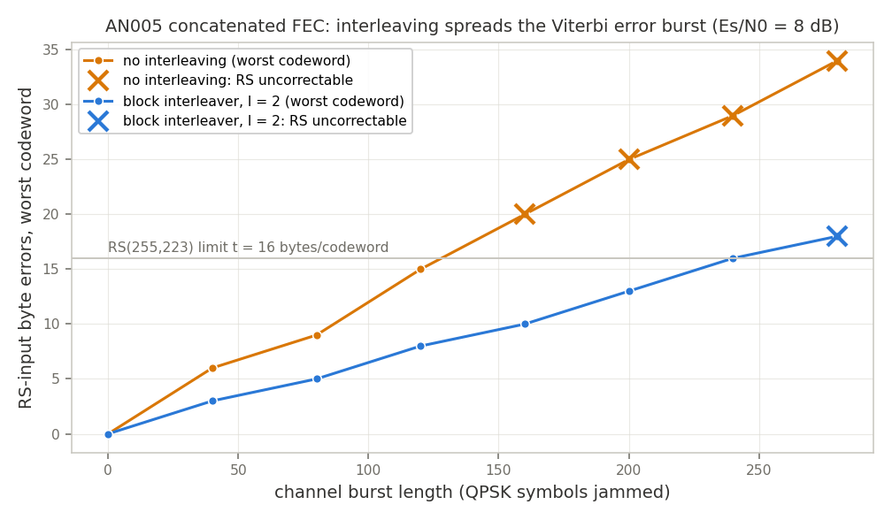

# AN005 — CCSDS Concatenated-FEC Telemetry Chain

Runnable example: [`examples/ccsds_telemetry.py`](../../examples/ccsds_telemetry.py) —
`python3 examples/ccsds_telemetry.py` (headless, self-checking, writes the plot below).

## Objective

Assemble the classic CCSDS 131.0-B deep-space telemetry stack from LiteDSP blocks — the
concatenated code that flew on Voyager and remains the reference coded telemetry link:
an outer Reed-Solomon RS(255,223) code, a **block interleaver of depth I**, and an inner
convolutional K=7 rate-1/2 code with soft-decision Viterbi decoding — and demonstrate *why
the interleaver is there*: a channel error burst that is **uncorrectable without
interleaving is fully corrected with it**, because the interleaver spreads the Viterbi
decoder's bursty errors across I RS codewords (~I× correctable-burst gain).

## Block diagram

```
         ┌─────────────┐ I x 255 ┌──────────────────┐        ┌───────────────┐        ┌──────────────┐
 message │  RSEncoder  │  bytes  │ BlockInterleaver │  8:1   │  ConvEncoder  │ 2-bit  │ SymbolMapper │  I/Q
─ bytes ►│  (255,223)  ├────────►│     (I x 255)    ├─ bits ►│ K=7, G=(171,  ├─ syms ►│    (QPSK)    ├────┐
         └─────────────┘  (row-  └──────────────────┘  LSB-  │  133), r=1/2  │ g0→I,  └──────────────┘    │
                           wise)  in row-wise,         first └───────────────┘ g1→Q                       │
                                  out column-wise                                                         ▼
                                              ┌───────────────────────────────────────────────────────────┐
                                              │ NumPy channel: AWGN at Es/N0 + JAMMER BURST               │
                                              │ (a span of channel symbols → random constellation points) │
                                              └───────────────────────────────────────────────────┬───────┘
         ┌─────────────┐         ┌──────────────────┐        ┌───────────────┐         ┌──────────▼───┐
 message │  RSDecoder  │ row-wise│BlockDeinterleaver│  1:8   │ViterbiDecoder │ 2x4-bit │ SoftDemapper │
◄─ bytes ┤  (255,223)  │◄─ out ──┤     (I x 255)    │◄ bits ─┤  (soft, K=7)  │◄─ LLRs ─┤ (4-bit LLRs) │
         └─────────────┘         └──────────────────┘ packed └───────────────┘         └──────────────┘
                                  in column-wise     to bytes
```

The interleaver sits **between the RS and convolutional layers, on bytes** — the CCSDS
convention. On the transmit side the I RS codewords of a frame are written into an I × 255
matrix row-wise (codeword by codeword, exactly the order a single time-shared `LiteDSPRSEncoder`
emits them) and transmitted column-wise: byte 0 of every codeword, then byte 1, … Adjacent
channel bytes therefore belong to *different* codewords. Viterbi errors arrive in bursts (a
wrong survivor path persists for tens of trellis steps), so after deinterleaving a burst of B
channel bytes lands as ≤ ⌈B/I⌉ errors in each codeword: the correctable burst grows from t = 16
bytes to ~I·t. CCSDS allows I ∈ {1, 2, 3, 4, 5, 8}; the blocks default to the typical I = 5
(`rows=5, cols=255`), the example uses I = 2 to keep runtime sane.

Both interleaver blocks are ping-pong buffered (2 × rows·cols bytes of block RAM): the writer
fills one bank while the reader drains the other, so back-to-back blocks stream gaplessly at
1 byte/cycle (asserted in `test/test_interleaver.py`).

## Documented deviations from CCSDS 131.0-B

- **Conventional-basis RS**: `litedsp.comm.rs` implements RS(255,223) over GF(2^8) with field
  polynomial 0x11D and fcr = 0. CCSDS specifies 0x187 with a *dual-basis* (Berlekamp) symbol
  representation. The chain structure, rates and burst behavior are identical; the byte stream
  is not bit-compatible with a real CCSDS channel without a basis-conversion stage (a
  documented follow-up in `litedsp/comm/rs.py`).
- **Interleaving depth**: the sweep uses I = 2 (I = 5 is the standard's typical depth — same
  blocks, `rows=5`); the RTL confirmation point defaults to I = 1 / one codeword purely for
  simulation time (see below).
- **Bit order**: bytes are serialized LSB-first (the litex `stream.Converter` order); CCSDS
  transmits MSB-first. The chain is byte-transparent either way since TX and RX agree.
- No attached-sync-marker/randomizer framing layer (`LiteDSPFrameSync`/`LiteDSPScrambler`
  are available for it); block boundaries are counted from reset, as in all LiteDSP FEC blocks.

## Chain & resources

| Block | Role | ECP5 LUT/FF/BRAM/DSP | Fmax (MHz) |
|---|---|---|---|
| `LiteDSPRSEncoder` (255,223) | outer encoder (systematic LFSR) | 487/265/0/0 | 119 |
| `LiteDSPBlockInterleaver` (5×255) | depth-I byte interleaver, ping-pong RAM | 164/85/2/0 | 200 |
| `LiteDSPConvEncoder` (K=7) | inner encoder | not characterized | - |
| `LiteDSPSymbolMapper` / `LiteDSPSoftDemapper` | QPSK map / 4-bit LLRs | 203/44/0/2 (demap) | - |
| `LiteDSPViterbiDecoder` (soft, K=7) | inner decoder (64-state parallel ACS) | 10691/3945/0/0 | 35 |
| `LiteDSPBlockDeinterleaver` (5×255) | inverse permutation | 162/85/2/0 | 187 |
| `LiteDSPRSDecoder` (255,223) | outer decoder (BM + Chien/Forney) | 3680/1321/1/0 | 74 |

(Reference numbers at the registry configurations from [`doc/resources.md`](../resources.md);
fmax values are the budget minima. The interleaver pair costs ~326 LUT + 4 BRAM — negligible
next to the Viterbi decoder it protects.)

Example configuration: QPSK with half-spacing 8000 (conv bit g0 on I, g1 on Q — two
independent BPSK channels), Es/N0 = 8 dB AWGN (≈ 4.6 dB Eb/N0 over the rate-0.437
concatenated code), 4-bit LLRs with `llr_scale = 24` (clean point ≈ ±6 of ±7), 64 flush bits
to drain the Viterbi survivor depth (traceback 56).

## The burst demo

The channel jams a contiguous span of QPSK symbols (each symbol = one trellis step) inside
one codeword's span with random constellation points, on top of the AWGN. The example runs
the *identical* chain with and without the (de)interleaver on the bit-exact golden models
(`test/models.py`) across burst lengths, then confirms with RTL:

```
burst   0 syms: no-ILV worst codeword  0 bytes OK              ILV worst  0 bytes OK
burst  40 syms: no-ILV worst codeword  6 bytes OK              ILV worst  3 bytes OK
burst  80 syms: no-ILV worst codeword  9 bytes OK              ILV worst  5 bytes OK
burst 120 syms: no-ILV worst codeword 15 bytes OK              ILV worst  8 bytes OK
burst 160 syms: no-ILV worst codeword 20 bytes UNCORRECTABLE   ILV worst 10 bytes OK
burst 200 syms: no-ILV worst codeword 25 bytes UNCORRECTABLE   ILV worst 13 bytes OK
burst 240 syms: no-ILV worst codeword 29 bytes UNCORRECTABLE   ILV worst 16 bytes OK
burst 280 syms: no-ILV worst codeword 34 bytes UNCORRECTABLE   ILV worst 18 bytes UNCORRECTABLE
```

Asserted golden properties:

- **the money demo**: the 160-symbol burst puts 20 byte errors into a single codeword
  (> t = 16) — *uncorrectable* without interleaving, RS decoder flags it and the message is
  corrupted; the same burst through the I = 2 interleaver lands as 10 + 10 — **message
  recovered error-free**;
- the burst is spread below t *only* with interleaving (10 ≤ 16 < 20);
- **correctable burst doubles** at I = 2: 120 → 240 symbols (gate ≥ 1.5×), tracking the
  I·t = 32-byte theoretical limit (the 240-symbol burst lands as exactly 16 + 15);
- **full RTL end-to-end**: every block simulated in Migen (streams handed intact between
  per-stage simulations), TX waveform asserted bit-identical to the model TX, demapper and
  Viterbi outputs asserted bit-exact against their golden models, and the message recovered
  **exactly** through RS encode → interleave → conv → QPSK/AWGN+burst → LLRs → soft
  Viterbi → deinterleave → RS decode.



## RTL runtime (and why the RTL point defaults to I = 1)

The soft Viterbi decoder (64-state parallel ACS + register exchange) simulates at ~30
symbols/s and the RS decoder at ~20 s/codeword in the Migen simulator, so the chain is
simulated *stage by stage* — each block gets its own simulation at full rate, and captured
streams are handed to the next stage intact (all FEC blocks count block boundaries from
reset, so this is exactly the composed behavior; the composite `CCSDSTx` runs as one
simulation). The default RTL point runs I = 1 / one RS codeword with a 60-symbol burst
(within a single codeword's t = 16): TX 26 s, demapper 1 s, Viterbi 48 s, deinterleave +
RS decode 128 s — ~3.5 minutes end to end. `AN005_RTL_DEPTH=2` (or `--rtl-depth 2`) replays
the sweep's 160-symbol *money burst* through the full I = 2 RTL chain (~8 minutes of
simulation) — recovered error-free where the non-interleaved chain is provably uncorrectable.

## Build & run

```
python3 examples/ccsds_telemetry.py                     # sweep + I=1 RTL point (~3.5 min)
AN005_RTL_DEPTH=2 python3 examples/ccsds_telemetry.py   # the money burst in RTL (~8 min)
python3 examples/ccsds_telemetry.py --plot-dir /tmp/plots
```

The model sweep takes a few seconds (bit-exact NumPy models, including the step-exact
`viterbi_model`); matplotlib is optional.

## Cross-links

- [`block_interleaver`](../blocks/block_interleaver.md) /
  [`block_deinterleaver`](../blocks/block_deinterleaver.md) — the depth-I byte interleaver
  pair (geometry, ping-pong buffering, framing)
- [`rs_encoder`](../blocks/rs_encoder.md) / [`rs_decoder`](../blocks/rs_decoder.md) —
  RS(255, k) codec (basis conventions, correction status CSRs)
- [`conv_encoder`](../blocks/conv_encoder.md) /
  [`viterbi_decoder`](../blocks/viterbi_decoder.md) — the inner K=7 code (hard/soft, LLR
  conventions, traceback depth)
- [`soft_demapper`](../blocks/soft_demapper.md) — max-log LLRs (scaling, saturation)
- [`puncturer`](../blocks/puncturer.md) — rate adaptation of the same inner code (DVB-S
  rates; combine with this chain for punctured CCSDS-style links)
- [`frame_sync`](../blocks/frame_sync.md) — preamble/ASM detection for the framing layer
  this app note leaves out
