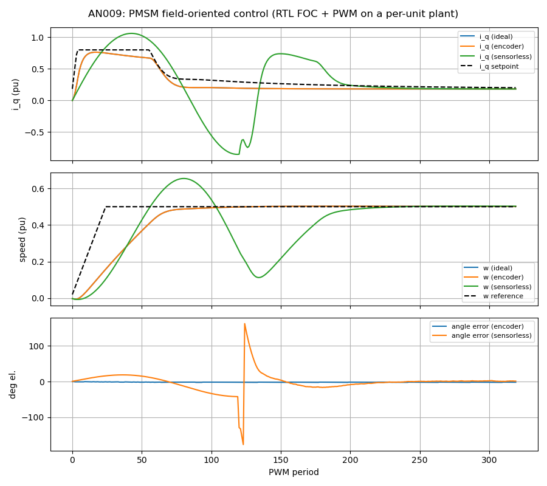

# AN009 — PMSM field-oriented control (RTL FOC + PWM on a per-unit motor model)

Example: [`examples/foc_pmsm.py`](../../examples/foc_pmsm.py)

## Objective

Close a complete field-oriented current + speed loop with the LiteDSP motor-control blocks —
the RTL `LiteDSPFOC` current controller and `LiteDSPPWM` generator — around a NumPy
per-unit PMSM/inverter model stepped once per PWM period, and show the three ways of getting
the rotor angle into the loop: an ideal sensor, the RTL `LiteDSPQuadratureDecoder` fed from
emulated A/B pins, and sensorless operation (`LiteDSPSMObserver` → `LiteDSPAngleTracker`)
after an open-loop V/f start. The golden properties are gated for all three variants: the
speed loop settles within 2 % of its target, the d-axis current stays below 0.08 pu, the
encoder angle error RMS is below 3° electrical and the sensorless angle error RMS below 10°.

The PWM's one-sample-per-period acceptance paces the loop through backpressure alone — the
plant generator waits for the carrier valley (the ADC trigger), integrates the period that
just started with the duties the PWM accepted, and hands the new currents to the controller;
the controller's output reaches the PWM before the next valley (one period of control delay,
as on hardware).

## Block diagram

```
                +-------------------------- LiteDSPFOC ---------------------------+
 i_abc (Q1.15)  | Clarke -> Park(mixer,down) -> DQController -> Park^-1(mixer,up) -> SVPWM |--> LiteDSPPWM --> gates
 --------------->|              ^   sin/cos ROM -> Split -> Delay(3) ----^                   |    (24-cycle    trigger
 angle ---------->|              |                                                            |     half period)   |
                +-----------------------------------------------------------------------+                    |
                      ^                                                                                       v
   ideal: plant angle |            PMSM dq model (R 0.05, L 0.3, psi 0.6, J 2.0 pu) <---- accepted duties  <--+
   encoder: A/B pins -> LiteDSPQuadratureDecoder (1024 counts, 2 pole pairs) --------------------+
   sensorless: i_ab, v_ab -> LiteDSPSMObserver -> LiteDSPAngleTracker --+-> ChannelMux ---------+
                                       LiteDSPAngleRamp (V/f start) ----'      (firmware selects)
```

- **Per-unit plant**: rotor-frame PMSM (`i_d' = i_d + Ts/L·(v_d − R·i_d + ω·L·i_q)`,
  `i_q' = i_q + Ts/L·(v_q − R·i_q − ω·L·i_d − ω·ψ)`, `ω' = ω + Ts/J·(ψ·i_q − T_load − B·ω)`)
  with `ω_b·Ts = 0.05` rad per period, Euler sub-stepped; the inverter is average-value
  (duties are phase voltages in units of `V_dc/2`).
- **Current loop**: pole-cancelling PI (`ki/kp = R/L·Ts`, `kp = 1.5` → closed-loop pole
  0.75), the same design rule as the block-level test. The per-unit gains map directly to the
  controller's Q4.12 registers.
- **Speed loop**: a Python PI at the period rate (the "firmware") with a slew-limited
  reference writes `dq_setpoint_q` — exactly what a CPU does over the CSR bus.
- **Encoder variant**: an emulated 1024-count incremental encoder toggles A/B every clock
  from the mechanical angle; the RTL decoder's 4x count, pole-pair scaling and reciprocal
  angle multiply feed the controller on the PWM trigger.
- **Sensorless variant**: 120 periods of open-loop V/f (`dq_control.open_loop`, a 0.25 pu
  vector from `LiteDSPAngleRamp` at 0.25 pu speed) bring the rotor up to an observable
  back-EMF, then the firmware switches the `ChannelMux` to the observer angle and closes the
  loops. The observer's sliding gain is set for the target operating point (≈ half the back-EMF).

### Documented simplifications

An honest demo subset, not a drive-grade controller: average-value inverter (no switching
ripple, dead-time or DC-link dynamics), no current-sense delay or ADC noise, no field
weakening or MTPA, a first-order per-unit mechanical model, and a fixed sliding gain instead of
a speed-scheduled one.

## Chain & resource total

ECP5 reference numbers (`impl/budgets.json`, 16-bit datapaths, registry configurations):

| Block (datasheet) | Instances | ECP5 LUT/FF/BRAM/DSP (ref) |
|---|---|---|
| [FOC current controller](../blocks/foc.md) | 1 | 2777/760/0/15 |
| [3-phase PWM](../blocks/pwm.md) | 1 | 310/223/0/1 |
| [Quadrature decoder](../blocks/quadrature_decoder.md) | 1 | 568/140/0/2 |
| [Sliding-mode observer](../blocks/smo_observer.md) | 1 | 2775/856/0/4 |
| [Angle tracker](../blocks/angle_tracker.md) | 1 | 677/97/0/0 |
| [Angle ramp](../blocks/angle_ramp.md) | 1 | 33/33/0/0 |
| **Indicative total** (all three sensing variants) | | **7140/2109/0/22** |

The FOC composite dominates: two complex mixers, two PI regulators, the modulator and a
quarter-wave sin/cos ROM (in LUTs on ECP5). The sensorless path adds a CORDIC-based observer.

## Build & run

```sh
python3 examples/foc_pmsm.py                       # three variants, prints the gates, PASS
python3 examples/foc_pmsm.py --plot-dir /tmp/an009  # + doc/app_notes/img/an009_foc.png
litedsp_gen examples/foc_core.yml                   # standalone AXI-Stream/AXI-Lite FOC core
```

## Results

Measured with the default 320 periods (`python3 examples/foc_pmsm.py`):

| Variant | Speed settles (±2 %) | \|i_d\| once settled | Angle error after settling |
|---|---|---|---|
| Ideal angle | 88 periods | 0.006 pu | — |
| `LiteDSPQuadratureDecoder` (1024 counts, 2 pole pairs, emulated A/B pins) | 88 periods | 0.009 pu | mean −1.9°, RMS 0.2° el. (one-period sample lag + count quantization) |
| Sensorless `LiteDSPSMObserver` → `LiteDSPAngleTracker` (open-loop start for 120 periods) | 210 periods (90 after the switch-over) | 0.10 pu (observer chatter; gated at 0.15) | mean 0.0° (lag calibrated: +14° offset), RMS 2.0° el. |

The current loop follows its first-order design (pole-cancelling gains): the `i_q` step at the
start of the speed ramp settles in a few periods without overshoot in the ideal and encoder
variants. In the sensorless variant the open-loop V/f start draws an uncontrolled current
(`i_q` peak 1.06 pu at the switch-over transient), then the observer angle takes over with a
constant lag that the calibrated tracker offset removes; the remaining 2° RMS chatter costs
~0.1 pu of d-axis current — the usual price of a sliding-mode observer without a speed-scheduled
sliding gain.

Gates (asserted by the example, `PASS` printed): speed within 2 % for the three variants,
\|i_d\| < 0.08 pu once settled (0.15 pu sensorless), encoder angle RMS < 3°, sensorless angle
RMS < 10°, current-loop overshoot < 10 %.


