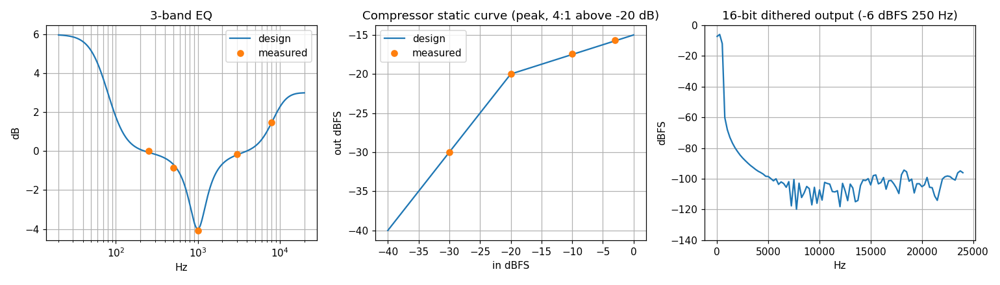

# AN010 — Stereo audio processor: I2S in, EQ, dynamics, dither, I2S out

`examples/audio_processor.py` assembles the audio family into the signal path of a small digital
audio product:

```
I2S RX (slave) -> AudioEQ -> Compressor -> Limiter -> Volume -> PeakMeter -> Dither(16-bit) -> I2S TX (master)
                  3 bands    RMS 4:1     -1 dBFS     0 dB                  2nd-order shaping
```

Every block is real RTL (`LiteDSPI2SReceiver`/`LiteDSPI2STransmitter`, `LiteDSPAudioEQ`,
`LiteDSPCompressor` x2, `LiteDSPVolume`, `LiteDSPPeakMeter`, `LiteDSPDither`), connected through
channel-tagged TDM streams (`tdm_layout(24, 2)`, `doc/audio.md`). Migen simulates these serial
engines at a few hundred cycles per second, so the example runs the chain in three short passes
that share the blocks and only carry the frames each gate needs (a single I2S-paced run of the
whole chain would take half an hour):

| Pass | Blocks | Stimulus | Gate |
|---|---|---|---|
| 1 tone chain | AudioEQ -> Volume -> PeakMeter -> Dither | A: 250, 500, 1000, 3000, 8000 Hz at -20 dBFS each; D: 250 Hz at -6 dBFS (EQ bypassed) | A: magnitude within 0.3 dB of the RBJ design (low shelf 80 Hz +6 dB, peak 1 kHz -4 dB Q 1.5, high shelf 8 kHz +3 dB) at every tone; D: THD+N of the 16-bit noise-shaped output in 20 Hz .. 10 kHz <= -80 dB |
| 2 dynamics chain | Compressor -> Limiter -> PeakMeter | B: 1 kHz at -30, -20, -10, -3 dBFS (128 frames each), compressor with peak detector, threshold -20 dB, ratio 4:1, instant attack, release 10 ms; C: 1 kHz at 0 dBFS through the limiter preset (-1 dBFS ceiling, instant attack, 32-frame lookahead) | B: output level within 1 dB of the static curve and within 0.1 dB of the bit-exact model; C: output peak <= -1 dBFS + 0.5 dB, within 0.1 dB of the model, clip count 0 |
| 3 I2S transport | I2S TX (24-bit master) => pins => I2S RX (slave) -> Dither (rounding) -> I2S TX (16-bit master) => pins => I2S RX (slave) | 48 random 24-bit frames, BCLK = sys/4 | the received 16-bit words equal the rounded stimulus |

The dynamics segments are separated by silence gaps; bypass bits are toggled in the middle of a
gap so the pipeline (up to the limiter's 32-frame lookahead) only carries silence while a
control changes, and the gaps locate the segments at the output. The two tone-chain
measurements start from reset (the 80 Hz shelf rings down over ~100 frames, which would
otherwise leak between segments), and the THD+N measurement bypasses the EQ whose settling
transient would take ~8 time constants to fall below the dither floor. The nominal sample rate
for the filter and time-constant design is 48 kHz.

## Results

```
pass 1a (tone chain, EQ): 352 frames
EQ    250 Hz +0.01 dB (design -0.06)  500 Hz -0.86 dB (design -0.67)  1000 Hz -4.07 dB (design -4.00)  3000 Hz -0.15 dB (design -0.19)  8000 Hz +1.47 dB (design +1.48)  -> max error 0.20 dB (limit 0.3)
pass 1b (tone chain, THD+N): 224 frames
THD+N -95.0 dB in 20 Hz..10 kHz (-79.6 dB full band: the 2nd-order shaper moves the dither noise above the audio band), -6 dBFS 250 Hz at the 16-bit output (limit -80.0)
pass 2 (dynamics chain): 784 frames
COMP  -30 -> -30.00 dBFS (design -30.00, model -30.00)  -20 -> -20.00 dBFS (design -20.00, model -20.00)  -10 -> -17.40 dBFS (design -17.50, model -17.40)  -3 -> -15.63 dBFS (design -15.75, model -15.63)  -> max error 0.12 dB vs design (limit 1.0), 0.000 dB vs model (limit 0.1)
LIM   0 dBFS in -> peak -0.96 dBFS (model -0.96, ceiling -1.0 +0.5), clip count 0
pass 3 (I2S transport): 48 frames
I2S   49 words received, transport bit-exact (stimulus frame 1 onwards)
PASS
```



*EQ magnitude vs. design (left), compressor static curve (middle), 16-bit output spectrum
(right).*

The EQ error (0.2 dB at 500 Hz) comes from the 4 ms analysis window (250 Hz bins, the shelf's
settling tail) and the Q4.28 coefficient quantization, below the 0.3 dB gate. The compressor
output equals the bit-exact model to the printed precision; against the design line `out = in -
(in - threshold) * (1 - 1/ratio)` it sits 0.1 dB high at the compressed levels, the peak detector
with an instant attack and a 10 ms release letting the gain reduction dip slightly between the
peaks of the sine. The limiter's lookahead lets its instant attack act before the peak, so a
0 dBFS sine leaves at -0.96 dBFS and the peak meter counts no clips. The 16-bit output's
full-band THD+N (-79.6 dB) is the price of the second-order noise shaper (its total noise power
is 7.8 dB above plain TPDF dither); in the 20 Hz .. 10 kHz band the shaper pays back with
-95 dB, 15 dB below the unshaped TPDF floor.

## On hardware

The chain's registers are the block CSRs; `litedsp/software/drivers.py` speaks the units used
above: `AudioEQDriver.set_bands([("lowshelf", 80, 6, 0.7071), ...])` designs, quantizes, loads
and commits the coefficients, `CompressorDriver.set_threshold_db(-20)` / `set_ratio(4)` /
`set_attack_ms(0.5)` / `set_release_ms(3)`, `VolumeDriver.set_db(channel, 0)`, and
`PeakMeterDriver.read_dbfs(channel)` / `clip_counts(2)`. `examples/audio_core.yml` generates the
EQ -> compressor -> volume -> dither part as a standalone AXI core; the I2S converters have pins
rather than stream ports and are instantiated next to it. A real design runs `sys` at tens of
MHz with a 3.072 MHz BCLK (`bclk_div` accordingly); the serial engines need 52 cycles per
stereo frame (`doc/audio.md`).

## Simplifications

* The compressor's time constants are short (0.5 / 3 ms) so each level step settles inside its
  128 frames; the presets default to 10 / 100 ms.
* Both channels carry the same signal; the stereo matrix, reverb and PDM converters are not in
  this chain (see their block tests and datasheets).

Run: `python3 examples/audio_processor.py --plot-dir doc/app_notes/img`.
