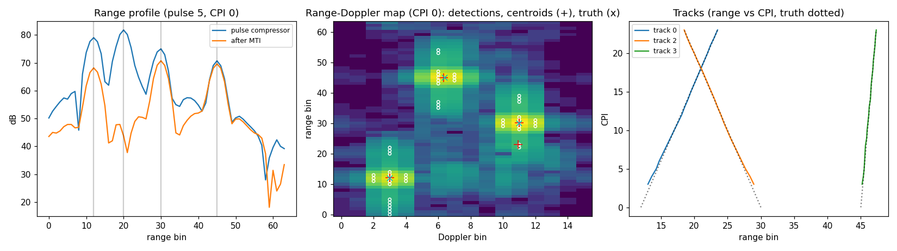

# AN011 — Pulse-Doppler radar: range gate to tracks

`examples/pulse_doppler_radar.py` assembles the radar family (`doc/radar.md`) into a complete
pulse-Doppler processor and runs it on a synthetic scene:

```
ADC -> RangeGate -> PulseCompressor -> MTICanceller -> CornerTurn -> DopplerProcessor -> CFAR2D -> PeakExtractor -> TargetList
       PRI 80       P=16 Hamming chirp  3-pulse         64 x 16       Hann + 16-pt FFT    (3,2)/(1,1)   local max + Q.4      16 records
                                                                                                                  \-> AlphaBetaTracker (8 slots)
```

Every block is real RTL. The scene has N = 64 range bins, M = 16 pulses per CPI, a PRI of 80
samples, a P = 16 chirp of bandwidth 0.5 fs, three moving targets, one stationary clutter return
and Gaussian noise (sigma = 200 LSB):

| Target | Range (bin) | Doppler (bin) | Amplitude | Motion (bins / CPI) |
|---|---|---|---|---|
| 0 | 12 | 3.0 | 0.5 | +0.5 range, +0.2 Doppler |
| 1 | 30 | 11.0 (= -5) | 0.3 | -0.5 range, +0.1 Doppler |
| 2 | 45 | 6.4 | 0.2 | +0.1 range, +0.05 Doppler |
| clutter | 20 | 0 | 0.8 | stationary |

Migen simulates the FIR-based compressor at a few thousand cycles per second, so the example
runs the chain in three passes that hand their captured streams to the next stage (two CPIs
of RTL data, then synthesised detections for the tracker):

| Pass | Blocks | Stimulus | Gates |
|---|---|---|---|
| 1 front end | RangeGate -> PulseCompressor -> MTICanceller -> CornerTurn | 2 CPIs + 1 PRI of ADC samples (2640) | slow-time framing; compressed profile peaks exactly at 12 / 20 / 30 / 45; MTI suppresses the clutter cell >= 30 dB |
| 2 detection | DopplerProcessor -> CFAR2D -> PeakExtractor -> TargetList | the pass-1 columns (+ one flush column) | 3 / 3 targets per CPI within 0.5 bin (the 6.4-bin target's Doppler within 0.35), at most 1 false alarm and 3 sidelobe detections per CPI, no detection at the clutter cell, list count = records |
| 3 tracking | AlphaBetaTracker | the pass-2 bursts + 22 synthesised CPIs (truth +/-0.1 bin, one false alarm per CPI, one dropped detection per target) | three confirmed tracks by CPI 4 and no other, same ids throughout, range RMS <= 0.35 bin over CPIs 8..23, range rate within 0.1 bin/CPI |

Two details of the chain are worth knowing. The pulse compressor emits P-1 pipeline beats
before its first frame tag, so the corner turn synchronises on the first `first` and the
example aligns its taps the same way; and the SDF FFT inside the Doppler processor releases a
column's tail only as the next column arrives, so pass 2 feeds one zero column after the data
(a live chain never stops, so nothing is needed there). The 2-D CFAR alpha comes from
`cfar_alpha(1e-4, 54, "magnitude")` for the 54-cell training box; its `threshold_min` floor
(40 LSB) keeps the zero-padded first and last rows and the MTI notch column, whose training
sums are near zero, from detecting noise.

## Chain & resources

ECP5 synthesis at the example geometry (`doc/resources.md`, `impl/budgets.json`):

| Block | LUT | FF | BRAM | DSP |
|---|---|---|---|---|
| `range_gate` | 363 | 96 | 0 | 0 |
| `pulse_compressor` (P = 16, classic) | 4236 | 3018 | 0 | 60 |
| `mti` (3-pulse, 64 bins) | 688 | 191 | 2 | 0 |
| `corner_turn` (64 x 16) | 166 | 136 | 4 | 0 |
| `doppler` (16 pulses, Hann, approx) | 1768 | 307 | 0 | 14 |
| `cfar_2d` ((4,2)/(1,1), 64 x 16) | 1375 | 723 | 4 | 5 |
| `peak_extractor` | 1006 | 427 | 0 | 0 |
| `target_list` (16) | 263 | 112 | 0 | 0 |
| `alpha_beta_tracker` (4 tracks) | 2507 | 981 | 0 | 8 |

The compressor dominates (4 P real multipliers for the two complex FIRs); `fir_architecture="mac"`
trades them for P / n_macs cycles per sample when the sample rate allows.

## Build & run

```sh
python3 examples/pulse_doppler_radar.py --plot-dir /tmp/an011    # ~1 min, prints PASS
```

## Results

```
[pass 1] framing ok, compressed peaks [12, 20, 30, 45] (expected [12, 20, 30, 45]), MTI clutter suppression 34.1 dB
[pass 2] targets found per CPI [3, 3] / 3, sidelobe detections [1, 0], false alarms [0, 0], max range / Doppler error 0.19 / 0.10 bin, clutter cell detected: 0
[pass 3] confirmed tracks [0, 2, 3] (targets 3), range RMS over CPIs 8..23 0.05 bin, max range-rate error 0.004 bin/CPI
  PASS: front end, detection and tracking gates met
```



*Range profile of pulse 5 before and after the MTI (left; the clutter at bin 20 drops into the
noise), the CPI-0 range-Doppler map with the CFAR detections, the interpolated centroids and
the truth (middle), and the three tracks against the truth over 24 CPIs (right).*

The compressed peaks land exactly on the target ranges because the compressor re-aligns the
frame tags by P-1 (range bin r of pulse p leaves at position r of frame p). The 3-pulse MTI
takes the stationary return down by 34 dB; what remains at bin 20 is noise (the two-pulse
history scales the noise by sqrt(6)/4). The Doppler processor puts the +3, -5 and 6.4-bin
targets at bins 3, 11 and 6 with the Hann window's sidelobes below the CFAR threshold; the peak
extractor's parabolic interpolation recovers the 6.4-bin Doppler to 0.10 bin and the ranges to
0.19 bin (the compressed peak shape is not a parabola, so the range centroid is biased by a few
tenths at most). The one remaining unmatched record in CPI 0 is a compression sidelobe of the
strongest target seven bins away in range at the same Doppler (P = 16 Hamming sidelobes sit
around -15 dB, above the threshold for a 40 dB target); the tracker gates reject it. The tracks
confirm at CPI 2, keep their ids through the crossing in range (the Doppler separation keeps
the gates apart) and through the dropped detections (two-CPI coasting), and settle to 0.05 bin
RMS with the range rate within 0.004 bin/CPI of the truth; the false alarms (one per CPI at a
random position) initialise tentative tracks that die after two misses and never confirm.

## Simplifications

Integer target ranges per CPI (no fractional delay in the stimulus, no range migration inside a
CPI), no transmit blanking (the range gate frames the receive window from the PRI start), a
single PRF (no staggered PRIs, Doppler ambiguity at +/-M/2 bins), no range-Doppler coupling of
the chirp, and a synthesised detection stream for the long tracking pass. The blocks' CSR
interfaces (`RangeGateDriver`, `CFARDriver`, `TargetListDriver`, `TrackerDriver`) are exercised
by the mock-bus tests rather than here.

## Cross-links

`doc/radar.md` (stream kinds, framing, units), `AN004` (chirp pulse compression on the FIR
pair this compressor wraps), `test/test_pulse_compressor.py`, `test/test_cfar_2d.py`,
`test/test_peak_extractor.py`, `test/test_tracker.py` (bit-exact models and bounds).
