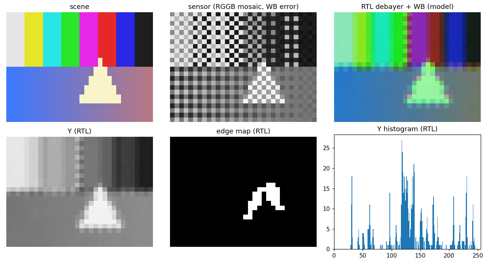

# AN012 — Image pipeline: Bayer sensor to YCbCr, statistics and an edge map

`examples/image_pipeline.py` assembles the image family (`doc/image.md`) into a small camera
front end and runs it on a synthetic scene:

```
sensor (RGGB, WB error) -> Debayer -> PixelGain (WB) -> ColorMatrix (RGB -> YCbCr, JPEG) -> Split
                                                            A: PixelHistogram (Y, 256 bins)
                                                            B: ColorMatrix (select Y) -> Kernel2D (Gaussian 3x3) -> Sobel (L1, /4)
                                                               -> Threshold (hysteresis 96 / 64) -> PixelHistogram (edge / non-edge)
```

Every block is real RTL on `pixel_layout` streams (`first` / `eol` / `last` framing, no
coordinates). The scene is a 32 x 24 RGB image (eight colour bars over a horizontal ramp with a
bright triangle); the sensor model scales red by 0.6 and blue by 0.8, adds a little noise, rounds
to 8 bits and samples an RGGB mosaic (`litedsp.image.design.mosaic`). Two identical frames are
streamed twice: free-flowing, then under random backpressure (sink throttle 0.3, source ready
0.6).

| Gate | Value |
|---|---|
| YCbCr frame | bit-exact against the integer model chain (debayer -> gain -> matrix); PSNR >= 40 dB against the float matrix on the same white-balanced pixels |
| edge map | bit-exact against the model chain; >= 95 % agreement with a float Gaussian + Sobel thresholded at the mid level; between 2 % and 50 % edge pixels |
| histograms | both sum to 768 pixels and equal `np.bincount`; frame 2 equals frame 1 |
| latency | branch B's first output at full rate lands exactly the declared `select + kernel + sobel + threshold` latency after its first input |

## Chain & resources

ECP5 synthesis at the registry geometries (`doc/resources.md`; the 2-D blocks are budgeted at
640-pixel lines, the example uses 32):

| Block | LUT | FF | BRAM | DSP |
|---|---|---|---|---|
| `debayer` | 905 | 376 | 2 | 0 |
| `pixel_gain` | 158 | 97 | 0 | 3 |
| `color_matrix` | 742 | 950 | 0 | 9 |
| `kernel_2d` | 1611 | 676 | 2 | 9 |
| `sobel` | 1163 | 372 | 2 | 1 |
| `threshold` | 85 | 13 | 0 | 0 |
| `pixel_histogram` | 362 | 160 | 2 | 0 |

The three line-buffered blocks (debayer, Gaussian, Sobel) each add `P * (width + P) + P + 3`
cycles of latency plus their arithmetic stages and push `P` virtual columns per line and `P`
virtual lines per frame; the flow's FIFO-backed auto-delay (or a `LiteDSPPixelFIFO`) would carry
the direct branch if the two were joined instead of measured separately.

## Build & run

```sh
python3 examples/image_pipeline.py --plot-dir /tmp/an012    # ~1 min, prints PASS
litedsp_gen examples/image_core.yml                          # the Debayer -> PixelGain -> RGB-to-YCbCr core
```

## Results

```
[free-flow] YCbCr bit-exact True, PSNR 59.0 dB vs float; edge map bit-exact True, 97.4 % agreement with the float Sobel; histograms 768 / 768 px (edge pixels 29); branch-B latency 83 (declared 83); frame 2 == frame 1 True
[backpressure] YCbCr bit-exact True, PSNR 59.0 dB vs float; edge map bit-exact True, 97.4 % agreement with the float Sobel; histograms 768 / 768 px (edge pixels 29); branch-B latency 107 (declared 83); frame 2 == frame 1 True
  PASS: YCbCr, edge map, histograms and latency gates met
```



*Scene, sensor mosaic, the demosaiced and white-balanced image (model), the RTL luma, the RTL edge
map and the RTL luma histogram.*

The RTL YCbCr frame equals the integer models bit for bit and sits 59 dB from the float matrix
(the Q4.12 coefficients and the single rounding are the whole difference). The edge map matches
the model and agrees with a float Gaussian + Sobel on 97.4 % of the pixels; the 2.6 % that
differ lie on the bar boundaries where the hysteresis (set at 96, reset below 64) and the plain
mid-level threshold of the reference decide differently. The second frame reproduces the first
exactly: the line buffers flush their trailing rows through the virtual lines and re-synchronise
on `first`, and the histograms drain between frames without an overrun. Under backpressure the
outputs stay identical (the branch latency measured in cycles grows with the stalls, which is
why that gate applies to the free-flowing pass only).

## Simplifications

Bilinear demosaicing (colour fringes at the bar boundaries are inherent), a 32-pixel line for
simulation speed (the blocks are sized by `width` / `max_width`), a synthetic sensor model with
constant white-balance error, and the statistics loops (exposure from `PixelStatsDriver`,
grey-world gains through `PixelGainDriver`, equalisation through `PixelLUTDriver`) exercised by
the mock-bus driver tests rather than here.

## Cross-links

`doc/image.md` (layouts, geometry rule, 2-D architecture), `examples/image_core.yml`,
`test/test_line_buffer.py`, `test/test_kernel_2d.py`, `test/test_sobel.py`,
`test/test_image_color.py`, `test/test_image_stats.py` (bit-exact models and bounds).
