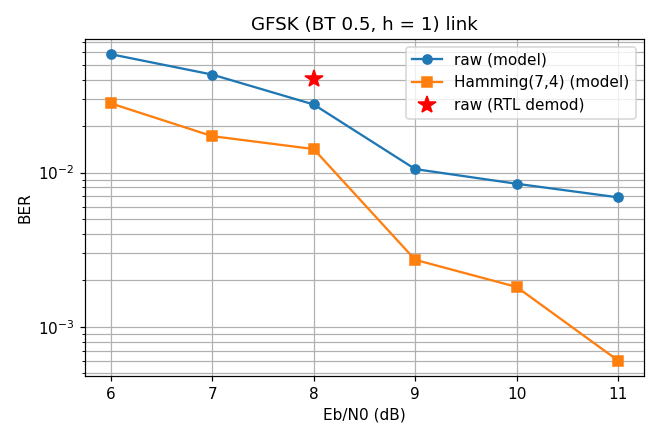

# AN013 — GFSK + Hamming + HDLC text link

`examples/fsk_hamming_link.py` builds a complete low-rate data link from the communications
extras and checks it against the Python models: a text message is framed by `LiteDSPHDLCFramer`,
protected by `LiteDSPHammingEncoder` (7,4), modulated by `LiteDSPFSKModulator` (GFSK, BT 0.5,
8 samples per bit, modulation index 1) and, after an AWGN channel and a `LiteDSPFMDemod`
discriminator receiver, decoded by `LiteDSPHammingDecoder` and `LiteDSPHDLCDeframer` back to text.



## Signal chain

```
text -> bits (LSB first)
  -> LiteDSPHDLCFramer(preamble=2)            flags, stuffing, X.25 FCS, closing flag
  -> LiteDSPHammingEncoder(m=3)               (7,4) blocks, framed
  -> LiteDSPFSKModulator(sps=8, bt=0.5)       Gaussian pulse filter + FM, deviation = fsk_deviation(1.0, 8)
  -> AWGN (NumPy) + boxcar pre-detection filter
  -> LiteDSPFMDemod                           discriminator
  -> timing acquisition + integrate-and-dump  (NumPy, the opening flags act as a preamble)
  -> LiteDSPHammingDecoder(m=3)               single-error correction, counters
  -> LiteDSPHDLCDeframer                      unstuffing, FCS check, last / fcs_ok
  -> text
```

The transmitter runs as one `LiteXModule` (sub-blocks `with_csr=False`); its I/Q output is
compared bit-exact with the composed models `hdlc_frame_model` → `hamming_encode_model` →
`fsk_modulator_model`. The receiver blocks are exercised on three bit streams: the clean coded
bits, one flipped bit per codeword and two flipped bits in one codeword.

## Gates

| Gate | Requirement | Measured |
|---|---|---|
| Transmitter waveform | bit-exact vs the composed models over 7728 I/Q samples | bit-exact |
| Clean receive | `fcs_ok`, text identical | pass |
| One error per codeword | every block corrected, `fcs_ok`, text identical | pass |
| Two errors in one codeword | `uncorrectable_count == 1`, FCS fails | pass |
| Model BER, Eb/N0 6 → 11 dB | coded below raw from 8 dB up | raw 5.8 % → 0.7 %, coded 2.8 % → 0.1 % |
| RTL demodulator point at 8 dB | raw BER within 3× of the model | 0.040 (model 0.028) |

The BER curve is measured on the model chain with six independent noise draws per point (966
coded bits each); the receiver keeps the discriminator above threshold with a boxcar of one
symbol before detection and acquires symbol timing on the first 64 bits. The RTL point runs the
same noisy waveform through `LiteDSPFMDemod`.

## Notes

- The link is the simplest of the receivers in this library (no carrier recovery: FSK with a
  discriminator is insensitive to a carrier offset far smaller than the deviation); the
  `LiteDSPTimingRecovery` / `LiteDSPFrameSync` blocks of AN002 apply when a coherent link is
  wanted.
- Hamming(7,4) only corrects one error per block, so the coding gain appears once the raw BER
  falls below about 3 %; a `LiteDSPBCHDecoder` (t = 2 .. 4) or the interleaver in front of it
  extends the corrected range at the cost of rate.
- The HDLC deframer withholds 24 bits and releases them when the closing flag is recognised, so
  the last payload bit carries `last` and `fcs_ok` together; an aborted frame shorter than that
  window leaves nothing on the output.

## Running

```sh
python3 examples/fsk_hamming_link.py --plot-dir /tmp/an013     # prints PASS, writes the figure
```

`test/test_examples.py` runs the script as a smoke test.
