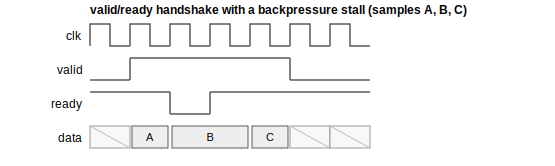
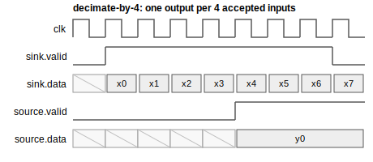
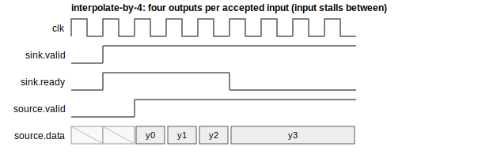
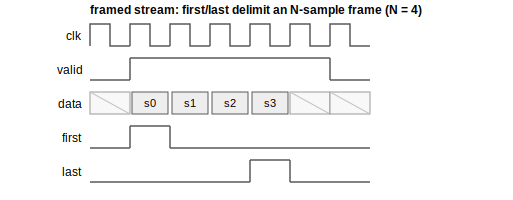
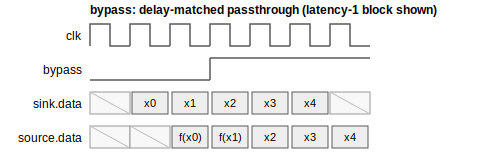

# LiteDSP Interface Contract

Every LiteDSP block obeys the same streaming + control contract so blocks compose by
`connect()` and are controlled uniformly. This is the core of the toolbox — follow it for any
new block.

## Streaming

- Blocks expose LiteX `stream.Endpoint`s named `sink` (input) and `source` (output). Blocks
  with several inputs use `sink_a`/`sink_b` (mixer) or a `sinks` list (combine).
- Payload layouts come from `litedsp.common`:
  - real samples: `real_layout(data_width)` → field `data` (signed).
  - complex samples: `iq_layout(data_width)` → fields `i`, `q` (signed).
- Full `valid`/`ready` backpressure is always honored. A block must not drop or duplicate
  samples under stalls. Stateful blocks (e.g. FIR) use an *elastic* pipeline: internal state
  (sample history) advances only on real transfers (`sink.valid & sink.ready`), while the
  arithmetic/valid pipeline drains on every accepted output beat. See `litedsp/filter/fir.py`.

  

- Rate changers accept/emit at their rate contract — the input stalls while an interpolator
  drains, a decimator consumes freely and emits once per window:

  
  

- Framed streams (FFT/PSD/capture/framer) delimit frames with the `first`/`last` params:

  

- Each block exposes its pipeline depth as `self.latency` (in **samples**; the flow
  auto-delay-balancer consumes it). Data-dependent blocks declare an explicit
  `self.latency = None`. Composites sum the latencies of their stages. Latency and bypass
  timing (below) are delay-matched:

  

  (Diagrams generated by `doc/wavedrom/render.py` from the WaveJSON sources in
  `doc/wavedrom/`.)

## Control

The control pattern generalizes the tetra `with_csr` convention and is mandatory:

- Constructors take `with_csr=True`. Hardware logic reads **plain control Signals**
  (`self.bypass`, `self.gain`, `self.phase_inc`, `self.factor`, …).
- `add_csr()` declares `CSRStorage`/`CSRStatus` (named `CSRField`s with `description=`/`values=`
  where it documents the SW interface) and wires them to those control Signals.
- With `with_csr=False`, a parent drives the control Signals directly. This is how composites
  (DDC/DUC) compose sub-blocks, and how tests drive blocks (often via `signal.reset = value`
  to make a control value stable from cycle 0).
- In-line, layout-preserving processing blocks (filter/correction/level categories) have a
  uniform boolean `self.bypass` (delay-matched passthrough, via `litedsp.common.add_bypass`;
  verified by `test/test_bypass.py`). Rate changers, transforms and sources/sinks have no
  bypass; the mixer's 2-bit `bypass` selects which input to pass instead.
- Blocks are wrapped with `@ResetInserter()` for per-instance reset.
- Trigger-type blocks (Squelch, EnergyDetector, Capture, AGC) additionally take
  `with_irq=True` / `add_irq()`: a LiteX `EventManager` (`self.ev`) with edge-triggered event
  sources on their status signals, so a SoC can route them to CPU interrupts
  (`soc.irq.add("<name>")`) instead of polling.

## Fixed-point

See `fixed_point.md`. In short: samples are signed Qm.n (default Q1.15 / 16-bit), and every
downsizing point goes through the shared `rounded`/`saturated`/`scaled` helpers — never raw
truncation or wrap.

## Conventions checklist for a new block

1. BSD-2-Clause header; imports grouped Migen → `litex.gen` → CSR/stream → `litedsp`.
2. `@ResetInserter()` `LiteXModule` (or `stream.PipelinedActor` only for *stateless* maps).
3. Declare endpoints + control Signals + `self.latency`, then `# # #`, then hardware.
4. Round + saturate at every multiply/accumulate downsize (`litedsp.common`).
5. `if with_csr: self.add_csr()` at the end; CSRs documented and aligned.
6. Add a NumPy model in `test/models.py` and a golden-model test in `test/test_<block>.py`
   (bit-exact for structural/arithmetic blocks, SNR threshold where rounding differs),
   exercised under randomized backpressure.
